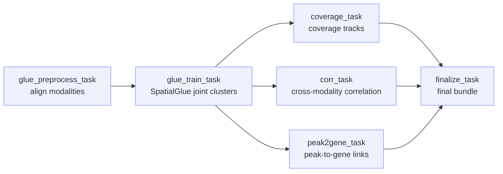

# atx_glue

!!! info "At a glance"
    **Repository:** [atlasxomics/atx_SpatialGlue](https://github.com/atlasxomics/atx_SpatialGlue) ·
    **Display name:** atx_glue ·
    **Modality:** Co-Profiling · **Stage:** Integration



<p style="text-align:center;font-size:0.75rem;opacity:0.7;margin-top:-0.5rem">
Workflow task DAG — the two modalities are aligned and jointly clustered, then
coverage, correlation, and peak-to-gene analyses feed the final bundle.
</p>

## Overview

**atx_glue** integrates epigenomic and transcriptomic modalities using [SpatialGlue](https://github.com/JinmiaoChenLab/SpatialGlue), producing joint clusters and cross-modality analyses (coverage, correlation, peak-to-gene links).

## Steps

1. **`glue_preprocess_task`** — Prepares and aligns the input AnnData objects
   (transcriptome, gene accessibility, and optional ATAC tiles) onto a shared
   spatial grid. Writes the prepared objects to `preprocess/`.
2. **`glue_train_task`** — Trains the [SpatialGlue](https://github.com/JinmiaoChenLab/SpatialGlue)
   model (`n_neighbors`, `min_cluster_size`), sweeps Leiden resolutions
   (`resolutions`, or `chosen_resolution` to pin one), and derives the **joint
   clusters**. Writes the clustered / plotting-optimized AnnData objects, the
   reusable `SpatialGlue_model.pickle`, the cluster sweep, marker / DE tables,
   and spatial cluster figures.
3. **`coverage_task`** — *(when an ATAC tile AnnData or ArchRProject is supplied)*
   Exports per-cluster genome **coverage BigWig tracks** to `coverages/`.
4. **`corr_task`** — Computes **RNA vs. ATAC gene-accessibility correlations**
   (Spearman; `min_frac_expressing`, optional `genes_of_interest`), with
   correlation, spatial-expression, and UMI figures.
5. **`peak2gene_task`** — *(when a `peak2gene_archr_project` is supplied)*
   Exports ArchR **Peak2Gene** link tables / BEDPE to `peak2gene/`.
6. **`finalize_task`** — Assembles the final bundle and writes the
   `Launch_Plots/artifact.json`.

Steps 3–5 run in parallel after training. If an optional stage cannot run, its
subdirectory contains a skip-reason text file instead.

## Inputs

| Parameter | Type | Description |
|---|---|---|
| `project_name` | str | Output folder name under `glue_outs/`. |
| `wt_anndata` | LatchFile | **Transcriptome** AnnData (gene expression) — from [optimize_wt](../transcriptome/optimize-wt.md). |
| `ge_anndata` | LatchFile | **Gene-accessibility** AnnData — from [ATX_snap](../epigenomics/atx-snap.md) / [create ArchRProject](../epigenomics/create-archrproject.md). |
| `coverages_genome` | enum | Genome for the track browser (default `hg38`). |
| `atac_anndata` | LatchFile | *(optional)* Epigenomic **tile** AnnData — enables coverage export. |
| `archr_project` | LatchDir | *(optional)* ArchRProject used to export coverages. |
| `peak2gene_archr_project` | LatchDir | *(optional)* ArchRProject with peaks, for Peak2Gene links. |
| `spatialglue_model_pickle` | LatchFile | *(optional)* Reuse a `SpatialGlue_model.pickle` from a previous run. |

??? note "Hidden / advanced parameters"
    | Parameter | Default | Description |
    |---|---|---|
    | `n_neighbors` | `15` | Neighbors used when clustering the joint embedding. |
    | `min_cluster_size` | `200` | Clusters smaller than this are merged into the nearest. |
    | `resolutions` | *(preset sweep)* | Comma-separated Leiden resolutions to sweep. |
    | `chosen_resolution` | `0.0` | Pin a resolution from the sweep (`0` = auto). |
    | `min_frac_expressing` | `0.05` | Minimum fraction of spots expressing a gene for the correlation. |
    | `genes_of_interest` | — | Comma-separated gene symbols for targeted plots. |

## Outputs

Written to `latch:///glue_outs/<project_name>/`.

```text
glue_outs/<project_name>/
├── rna_copro.h5ad                  # full   — transcriptome, joint clusters
├── rna_copro_sm.h5ad               # reduced (Plots only)
├── atac_gs_copro.h5ad              # full   — ATAC gene score, joint clusters
├── atac_gs_copro_sm.h5ad           # reduced (Plots only)
├── combined_ge.h5ad
├── SpatialGlue_model.pickle        # reusable trained model
├── spatialglue_cluster_sweep.csv, archr_sg_clusters.csv
├── deg_clusters.csv, gene_stats.csv          # markers / DE
├── *_spearman*.csv, per_cluster_rna_atac_ge.csv   # RNA↔ATAC correlation tables
├── *.png                           # spatial cluster, correlation, UMI figures
├── coverages/                      # per-cluster BigWig tracks (optional)
├── peak2gene/                      # ArchR Peak2Gene links / BEDPE (optional)
├── preprocess/                     # prepared AnnData + manifest
└── Launch_Plots/artifact.json
```

### Integrated objects

| File | Description |
|---|---|
| `rna_copro.h5ad`, `atac_gs_copro.h5ad` | **Full** joint-clustered transcriptome and ATAC gene-score AnnData — use these for any downstream calculation. |
| `rna_copro_sm.h5ad`, `atac_gs_copro_sm.h5ad` | **Reduced (`_sm`)** versions loaded by [Co-Profiling Plots](plots.md) — see the note below. |
| `combined_ge.h5ad` | Combined gene-expression AnnData. |
| `SpatialGlue_model.pickle` | The trained SpatialGlue model, reusable via `spatialglue_model_pickle`. |

!!! warning "Don't compute on the reduced (`_sm`) objects"
    As with the secondary-analysis Workflows, the `_sm` objects are
    plotting-optimized — the feature matrix `.X` is cast to `float16` and raw
    counts / layers are stripped — so they are **for visualization only**. Use
    the full `rna_copro.h5ad` / `atac_gs_copro.h5ad` for differential expression,
    marker detection, re-clustering, etc.

### Tables & figures

| File | Description |
|---|---|
| `spatialglue_cluster_sweep.csv` | Leiden resolution sweep results. |
| `archr_sg_clusters.csv` | SpatialGlue cluster assignments (ArchR-compatible). |
| `deg_clusters.csv`, `gene_stats.csv` | Per-cluster marker genes and gene statistics. |
| `atac_rna_spearman_all_genes.csv`, `ge_vs_rna_spearman.csv`, `per_cluster_rna_atac_ge.csv` | RNA ↔ ATAC gene-accessibility Spearman correlation tables. |
| `spatial_sg_clusters.png`, `spatial_clusters.png` | Spatial joint-cluster maps. |
| `corr_volcano.png`, `atac_rna_correlation_overview.png`, `*_spatial_expression.png`, `top_genes_bar.png`, `umi_violin_per_cluster.png` | Correlation, spatial-expression, and UMI QC figures. |

### Optional subdirectories

| Path | Description |
|---|---|
| `coverages/` | Per-cluster coverage BigWig tracks (`*_cluster.bw`, `*_RNA_cluster.bw`, `*_ATAC_cluster.bw`) + `coverage_manifest.csv`. Written when an ATAC tile AnnData or ArchRProject is supplied. |
| `peak2gene/` | ArchR Peak2Gene link tables, BEDPE files, and summaries. Written when `peak2gene_archr_project` is supplied. |
| `preprocess/` | The prepared per-modality AnnData (`ge_prepared.h5ad`, `rna_prepared.h5ad`, `atac_tiles_prepared.h5ad`) + `prepared_manifest.csv`. |
| `Launch_Plots/artifact.json` | Latch Plots artifact for opening the result in the Co-Profiling Plots template. |

## Example run

*(Representative LaunchPlan / batch-table example to be added.)*
