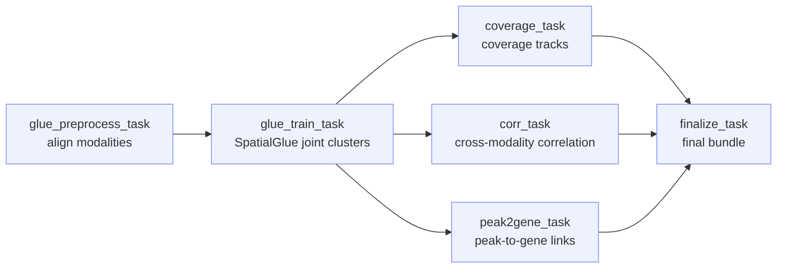

# atx_glue

!!! info "At a glance"
    **Repository:** [atlasxomics/atx_SpatialGlue](https://github.com/atlasxomics/atx_SpatialGlue) ·
    **Display name:** atx_glue ·
    **Modality:** Co-Profiling · **Stage:** Integration


```mermaid
flowchart LR
    PREP["glue_preprocess_task<br/>align modalities"]:::process
    TRAIN["glue_train_task<br/>SpatialGlue joint clusters"]:::process
    COV["coverage_task<br/>coverage tracks"]:::process
    CORR["corr_task<br/>cross-modality correlation"]:::process
    P2G["peak2gene_task<br/>peak-to-gene links"]:::process
    FIN["finalize_task<br/>final bundle"]:::process

    PREP --> TRAIN
    TRAIN --> COV & CORR & P2G
    COV & CORR & P2G --> FIN

    classDef process stroke:#818cf8,fill:#eef2ff
```

<p style="text-align:center;font-size:0.75rem;opacity:0.7;margin-top:-0.5rem">
Workflow task DAG — the two modalities are aligned and jointly clustered, then
coverage, correlation, and peak-to-gene analyses feed the final bundle.
</p>

## Overview

**atx_glue** integrates epigenomic and transcriptomic modalities using [SpatialGlue](https://github.com/JinmiaoChenLab/SpatialGlue), producing joint clusters and cross-modality analyses (coverage, correlation, peak-to-gene links).

## Steps

1. **`glue_preprocess_task`** — Prepares and aligns the input AnnData objects
   (transcriptome, gene accessibility, and optional ATAC tiles) onto a shared
   spatial grid. Writes the prepared objects to `preprocess/`.
2. **`glue_train_task`** — Trains the [SpatialGlue](https://github.com/JinmiaoChenLab/SpatialGlue)
   model (`n_neighbors`, `min_cluster_size`), sweeps Leiden resolutions
   (`resolutions`, or `chosen_resolution` to pin one), and derives the **joint
   clusters**. Writes the clustered / plotting-optimized AnnData objects, the
   reusable `SpatialGlue_model.pickle`, the cluster sweep, marker / DE tables,
   and spatial cluster figures.
3. **`coverage_task`** — *(when an ATAC tile AnnData or ArchRProject is supplied)*
   Exports per-cluster genome **coverage BigWig tracks** to `coverages/`.
4. **`corr_task`** — Computes **RNA vs. ATAC gene-accessibility correlations**
   (Spearman; `min_frac_expressing`, optional `genes_of_interest`), with
   correlation, spatial-expression, and UMI figures.
5. **`peak2gene_task`** — *(when a `peak2gene_archr_project` is supplied)*
   Exports ArchR **Peak2Gene** link tables / BEDPE to `peak2gene/`.
6. **`finalize_task`** — Assembles the final bundle and writes the
   `Launch_Plots/artifact.json`.

Steps 3–5 run in parallel after training. If an optional stage cannot run, its
subdirectory contains a skip-reason text file instead.

## Inputs

| Parameter | Type | Description |
|---|---|---|
| `project_name` | str | Output folder name under `copro_integration_analysis/`. |
| `wt_anndata` | LatchFile | **Transcriptome** AnnData (gene expression) — from [optimize_wt](../transcriptome/optimize-wt.md). |
| `ge_anndata` | LatchFile | **Gene-accessibility** AnnData — from [ATX_snap](../epigenomics/atx-snap.md) / [create ArchRProject](../epigenomics/create-archrproject.md). |
| `coverages_genome` | enum | Genome for the track browser (default `hg38`). |
| `atac_anndata` | LatchFile | *(optional)* Epigenomic **tile** AnnData — enables coverage export. |
| `archr_project` | LatchDir | *(optional)* ArchRProject used to export coverages. |
| `peak2gene_archr_project` | LatchDir | *(optional)* ArchRProject with peaks, for Peak2Gene links. |
| `spatialglue_model_pickle` | LatchFile | *(optional)* Reuse a `SpatialGlue_model.pickle` from a previous run. |
| `generate_coverages` | bool | Write per-cluster coverage BigWig tracks (default `True`). Set `False` to skip the coverage stage. |

??? note "Hidden / advanced parameters"
    | Parameter | Default | Description |
    |---|---|---|
    | `n_neighbors` | `15` | Neighbors used when clustering the joint embedding. |
    | `min_cluster_size` | `200` | Clusters smaller than this are merged into the nearest. |
    | `resolutions` | *(preset sweep)* | Comma-separated Leiden resolutions to sweep. |
    | `chosen_resolution` | `0.0` | Pin a resolution from the sweep (`0` = auto). |
    | `min_frac_expressing` | `0.05` | Minimum fraction of spots expressing a gene for the correlation. |
    | `genes_of_interest` | — | Comma-separated gene symbols for targeted plots. |

## Outputs

Written to `latch:///copro_integration_analysis/<project_name>/`.

```text
copro_integration_analysis/<project_name>/
├── rna_copro.h5ad                  # full   — transcriptome, joint clusters
├── rna_copro_sm.h5ad               # reduced (Plots only)
├── atac_gs_copro.h5ad              # full   — ATAC gene score, joint clusters
├── atac_gs_copro_sm.h5ad           # reduced (Plots only)
├── atac_tiles_copro.h5ad           # only when atac_anndata is supplied
├── combined_ge.h5ad
├── SpatialGlue_model.pickle        # reusable trained model
├── tables/                         # all tabular outputs
├── figures/                        # all static figures
│   ├── clustering/                 # per-resolution UMAP / spatial plots
│   └── genes_of_interest/          # per-gene spatial + violin plots
├── coverages/                      # per-cluster BigWig tracks (optional)
├── peak2gene/                      # ArchR Peak2Gene links / BEDPE (optional)
├── preprocess/                     # prepared AnnData + manifest
└── Launch_Plots/artifact.json
```

!!! note "Tables and figures are in subdirectories"
    Every `.csv` is under `tables/` and every `.png` under `figures/` — nothing
    tabular or graphical is written to the top level, which holds only the
    objects and the model pickle.

### Integrated objects

| File | Description |
|---|---|
| `rna_copro.h5ad`, `atac_gs_copro.h5ad` | **Full** joint-clustered transcriptome and ATAC gene-score AnnData — use these for any downstream calculation. |
| `rna_copro_sm.h5ad`, `atac_gs_copro_sm.h5ad` | **Reduced (`_sm`)** versions loaded by [Co-Profiling Plots](plots.md) — see the note below. |
| `atac_tiles_copro.h5ad` | Clustered ATAC **tile** AnnData — only when `atac_anndata` is supplied. |
| `combined_ge.h5ad` | Combined gene-expression AnnData. |
| `SpatialGlue_model.pickle` | The trained SpatialGlue model, reusable via `spatialglue_model_pickle`. |

The main cluster label is **`sg_clusters`**. The raw and merged Leiden labels
for every resolution in the sweep are also retained, named like
`sg_leiden_0p4` and `sg_leiden_0p4_merged`.

!!! warning "Don't compute on the reduced (`_sm`) objects"
    As with the secondary-analysis Workflows, the `_sm` objects are
    plotting-optimized — the feature matrix `.X` is cast to `float16` and made
    dense, and raw counts / layers are stripped — so they are **for
    visualization only**. Use the full `rna_copro.h5ad` /
    `atac_gs_copro.h5ad` for differential expression, marker detection,
    re-clustering, etc.

### Neighborhood enrichment

All four objects carry **Squidpy neighborhood-enrichment** results: a
permutation test over the spatial neighbor graph scoring which pairs of clusters
sit adjacent in tissue more (or less) often than chance. Because co-profiling
puts both modalities on the **same spots**, enrichment is computed once and
shared across the RNA and gene-accessibility outputs.

It is computed for each of the three clusterings that are present —
**`CoPro_cluster`** (the joint SpatialGlue labels), **`RNA_cluster`**, and
**`ATAC_cluster`** — which lets you ask whether the joint clustering captures a
spatial arrangement that neither modality recovers alone.

| `uns` key | Contents |
|---|---|
| `<cluster_key>_nhood_enrichment` | The cluster × cluster z-score / count matrices for that clustering across all spots. |
| `<cluster_key>_nhood_enrichment_by_group` | The same, split by `sample` and by `condition`, in a compact HDF5-safe schema. |

The three cluster keys are also written back onto the full objects as
categorical `obs` columns. The large spatial-neighbor graph itself is
**deliberately discarded** — only the small result matrices are kept, so the
reduced objects can draw these heatmaps without carrying the graph. Enrichment
is skipped if the cluster annotations or spatial coordinates are unavailable.

### Tables (`tables/`)

**Clustering**

| File | Description |
|---|---|
| `spatialglue_cluster_sweep.csv` | Leiden resolution sweep summary — resolution, raw and merged cluster keys, cluster counts before and after small-cluster merging, Moran's I, `min_cluster_size`, and `n_neighbors`. Holds a single row when `chosen_resolution` is set. |
| `archr_sg_clusters.csv` | SpatialGlue cluster assignments in ArchR-compatible form. |

**RNA ↔ ATAC correlation**

| File | Description |
|---|---|
| `atac-ge_vs_rna_spearman.csv` | Spearman correlation of RNA expression against gene accessibility, for genes passing `min_frac_expressing` — correlation, p-value, BH q-value, mean RNA, mean accessibility, absolute correlation. |
| `atac_rna_spearman_all_genes.csv` | Notebook-friendly version of the same table (`spearman_r`, mean UMI, expression fraction, p/q-values). |
| `gene_stats.csv` | Per-gene RNA UMI and gene-accessibility summary statistics, with the expression-rate filter metadata and merged correlation results. Written even when no gene passes the filter. |
| `per_cluster_rna_atac_ge.csv` | Per-cluster mean RNA and mean gene accessibility for the genes of interest, or the top correlated genes. |
| `umi_per_cluster_genes_of_interest.csv` | Per-cluster UMI summary for those genes — total UMI, mean UMI per spot, percent of spots expressing. |

**Markers**

| File | Description |
|---|---|
| `rna_deg_clusters.csv`, `ge_deg_clusters.csv` | Cluster marker tables (Scanpy Wilcoxon) for RNA and gene accessibility; the RNA table filters out mitochondrial and ribosomal genes. |
| `rna_deg_clusters_top50.csv`, `ge_deg_clusters_top50.csv` | Top markers per SpatialGlue cluster. |
| `rna_cluster_marker_heatmap_top50.csv`, `ge_cluster_marker_heatmap_top50.csv` | The matrices behind the marker heatmaps — column-wise z-scores of mean expression / accessibility, clipped to ±3. |

**Spatially variable features**

| File | Description |
|---|---|
| `svg_rna.csv`, `svg_ge.csv` | Spatial-autocorrelation results for RNA genes and gene-accessibility features. Written when spatial coordinates are available. |

Marker, per-cluster, and spatially variable gene outputs are skipped when the
required cluster labels, spatial coordinates, or gene counts are unavailable.

### Figures (`figures/`)

| File | Description |
|---|---|
| `spatial_sg_clusters.png` | Spatial map of the final selected SpatialGlue clusters. |
| `spatial_clusters.png` | Spatial cluster report split by sample. |
| `umap.png` | UMAP colored by `sg_clusters`. |
| `atac_rna_correlation_overview.png` | Correlation QC — abundance vs. Spearman correlation, plus the correlation distribution. |
| `top_genes_bar.png`, `corr_volcano.png` | Top correlated genes, and the correlation volcano (by strength and q-value). |
| `rna_cluster_marker_heatmap_top50.png`, `ge_cluster_marker_heatmap_top50.png` | Marker heatmaps by SpatialGlue cluster. |
| `svg_spatial_rna_<sample>.png`, `svg_spatial_ge_<sample>.png` | Spatial maps of the top spatially variable features, one per sample. |
| `clustering/umap_<cluster_key>.png`, `clustering/spatial_<cluster_key>.png` | Per-resolution UMAP and spatial plots for every merged cluster key in the sweep, plus the final `sg_clusters`. |
| `genes_of_interest/rna_spatial_expression_<sample>.png`, `genes_of_interest/atac_ge_spatial_expression_<sample>.png` | Spatial RNA and gene-accessibility maps for the requested genes (or fallback top correlated genes). |
| `genes_of_interest/rna_vs_atac_ge_spatial_expression_<sample>_<gene>.png` | Side-by-side RNA vs. gene-accessibility maps, per gene and sample. |
| `genes_of_interest/umi_violin_per_cluster_<gene>.png` | Expression by SpatialGlue cluster, per selected gene. |

### Optional subdirectories

| Path | Description |
|---|---|
| `coverages/` | Per-cluster coverage BigWig tracks (`*_cluster.bw`, `*_RNA_cluster.bw`, `*_ATAC_cluster.bw`) + `coverage_manifest.csv`. Export uses `atac_anndata` when supplied, otherwise `archr_project`. If neither is available the stage is skipped and `coverages/coverage_skipped.txt` is written; if `generate_coverages` is `False`, `coverages/coverage_disabled.txt` is written instead. |
| `peak2gene/` | ArchR Peak2Gene link tables, BEDPE files, and summaries. Written when `peak2gene_archr_project` is supplied. |
| `preprocess/` | The prepared per-modality AnnData (`ge_prepared.h5ad`, `rna_prepared.h5ad`, `atac_tiles_prepared.h5ad`) + `prepared_manifest.csv`. |
| `Launch_Plots/artifact.json` | Latch Plots artifact for opening the result in the Co-Profiling Plots template. |

## Example run

*(Representative LaunchPlan / batch-table example to be added.)*
