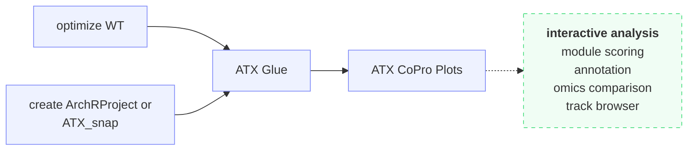

# Co-Profiling

Co-Profiling is an **optional** path that combines the secondary-analysis
outputs of the epigenomic and whole-transcriptome paths into a single
integrated analysis.

## How the workflows fit together

**Walking the flow:**

1. **Inputs from both paths.** Co-Profiling begins where the two modality paths
   leave off — the epigenomic objects from
   [create ArchRProject](../epigenomics/create-archrproject.md) or
   [ATX_snap](../epigenomics/atx-snap.md), and the transcriptome AnnData from
   [optimize_wt](../transcriptome/optimize-wt.md). Both must be run first.
2. **Integrate.** [ATX Glue](atx-glue.md) uses
   [SpatialGlue](https://github.com/JinmiaoChenLab/SpatialGlue) to spatially
   align the two modalities and derive **joint clusters**, along with
   cross-modality analyses (coverage, correlation, and peak-to-gene links).
3. **Visualize.** The integrated result is explored in
   [ATX CoPro Plots](plots.md) — interactive module scoring, annotation,
   omics comparison, and track browser.

## Workflows

| Workflow | Purpose |
|---|---|
| [atx_glue](atx-glue.md) | Integrate epigenome and transcriptome with SpatialGlue. |
| [Co-Profiling Plots](plots.md) | Interactive visualization of integrated results. |
