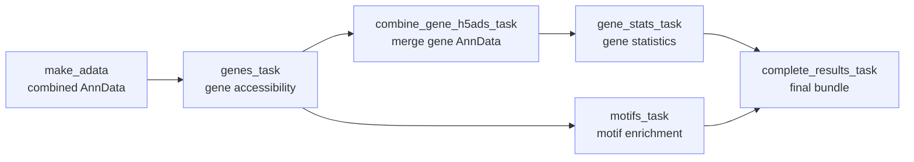

# ATX_snap

!!! info "At a glance"
    **Repository:** [atlasxomics/ATX_snap](https://github.com/atlasxomics/ATX_snap) ·
    **Display name:** atx_snap ·
    **Modality:** Epigenomics · **Stage:** Secondary Analysis



<p style="text-align:center;font-size:0.75rem;opacity:0.7;margin-top:-0.5rem">
Workflow task DAG — the combined AnnData feeds gene, motif, and statistics tasks,
which are assembled into the final bundle. (Internal Registry upload omitted.)
</p>

## Overview

**ATX_snap** is the [SnapATAC2](https://kzhang.org/SnapATAC2/)-based secondary
analysis Workflow — the computationally intensive counterpart to
[optimize_snap](optimize-snap.md). Using the parameters selected during
optimization, it produces analysis-ready AnnData objects, gene-accessibility
matrices, and motif results for a spatial ATAC experiment. All input Runs are
merged into a single combined object.

### SnapATAC2 (Python) ↔ ArchR (R)

ATX_snap deliberately splits the work across two ecosystems, playing to each
tool's strengths:

- **[SnapATAC2](https://kzhang.org/SnapATAC2/) / Python** performs the core
  dimensionality reduction and **clustering** — the tile matrix, spectral
  embedding, and Leiden clusters are all computed on the AnnData object.
- **[ArchR](https://www.archrproject.com/) / R** then performs the downstream
  biology — **gene-accessibility scores, motif deviations, and marker
  statistics** — using ArchR's mature, well-validated implementations.

The two sides communicate **through files**, not a live bridge:

1. SnapATAC2 exports the cell metadata and **cluster labels** to
   `tables/obs.csv`.
2. That table, together with each Run's fragments and
   [Spatial folder](../reference/glossary.md#spatial-folder), is passed to the
   ArchR R scripts (`archr_genes.R`, `archr_motifs.R`, `archr_gene_stats.R`).
   ArchR builds an ArchRProject from the fragments and adopts the SnapATAC2
   clusters as its grouping, so both ecosystems agree on the same cells and
   clusters.
3. ArchR's Seurat objects are converted **back to AnnData**
   (`seurat_to_h5ad` → `<run_id>_g_converted.h5ad` / `<run_id>_m_converted.h5ad`)
   and its result tables written as CSVs, which Python then merges and finalizes.

## Steps

The tasks run in sequence, each enriching the results directory.

1. **`make_adata`** *(SnapATAC2 / Python)* — Builds the combined cell-by-tile
   AnnData. Bins the genome into fixed-width tiles and counts fragments per tile
   (`tile_size`), filters low-quality cells (`min_tss`, `min_frags`), and selects
   the most accessible tiles as features (`n_features`). It then reduces
   dimensionality with SnapATAC2's spectral embedding (`n_comps`), builds a
   nearest-neighbor graph, and calls **Leiden clusters** (`resolution`,
   `clustering_iters`, `leiden_iters`, `min_cluster_size`), and attaches each
   tixel's spatial coordinates. These clusters are the grouping used by every
   later step.
2. **`genes_task`** *(ArchR / R)* — Computes **gene-accessibility scores** with
   ArchR's `GeneScoreMatrix` model. For each gene, ATAC signal (Tn5 insertions)
   across the gene body and a surrounding regulatory window is summed with
   **exponential distance weighting** from the gene — closer, more accessible
   regions contribute more — while respecting neighboring-gene boundaries so
   signal doesn't leak between genes. The scores are smoothed across similar
   cells with imputation weights, yielding a cells × genes matrix that serves as
   a **proxy for gene expression**: it lets you identify cell types from marker
   genes and compare the epigenome on a gene-level, expression-like scale.
3. **`combine_gene_h5ads_task`** *(Python)* — Merges the per-Run gene-accessibility
   results into a single combined cell-by-gene object spanning all Runs.
4. **`motifs_task`** *(ArchR / R)* — Computes **motif deviations** using
   [chromVAR](https://greenleaflab.github.io/chromVAR/) (via ArchR's
   `addDeviationsMatrix`). For each transcription-factor motif, it aggregates
   accessibility across all peaks that contain the motif and compares it to a set
   of **background peaks matched for GC content and average accessibility**,
   producing a per-cell, bias-corrected **deviation z-score**. High deviation
   means a TF's binding sites are more accessible than expected in that cell — a
   proxy for **TF regulatory activity** — which can then be summarized per
   cluster to find the regulators that distinguish cell populations.
5. **`gene_stats_task`** *(ArchR / R)* — Runs **differential testing per cluster**
   to identify cluster-specific **marker genes** and gene-level statistics.
6. **`complete_results_task`** *(Python)* — Assembles the base, gene,
   gene-expression, gene-stats, and motif outputs into the final results bundle.

!!! note "Internal step"
    A final `registry_task` writes outputs to the Latch Registry (see
    [Internal Tasks](../getting-started/platform-overview.md#internal-atx-only-tasks)).

## Inputs

**Per Run** (`runs: List[Run]`):

| Field | Type | Description |
|---|---|---|
| `run_id` | str | Identifier for the Run. |
| `fragments_file` | LatchFile | `fragments.tsv.gz` from preprocessing. |
| `spatial_dir` | LatchDir | [Spatial folder](../reference/glossary.md#spatial-folder). |
| `condition` | str | Optional experimental condition. |

**Global parameters:**

| Parameter | Type | Default | Description |
|---|---|---|---|
| `genome` | enum | — | Reference genome. |
| `project_name` | str | — | Output folder name. |
| `tile_size` | int | `5000` | Tile-matrix bin size. |
| `n_features` | int | `25000` | Most-accessible tiles used for analysis. |
| `n_comps` | int | `30` | Spectral-embedding dimensions. |
| `resolution` | float | `1.0` | Leiden clustering resolution. |
| `clustering_iters` | int | `1` | Iterative feature-selection rounds. |
| `output_dir` | LatchDir | `latch:///snap_outs/` | Output location. |

??? note "Hidden / advanced parameters"
    | Parameter | Default | Description |
    |---|---|---|
    | `leiden_iters` | `-1` | Leiden iterations (`-1` = until convergence). |
    | `min_cluster_size` | `20` | Minimum cells per cluster. |
    | `min_tss` | `2.0` | Minimum TSS enrichment per cell. |
    | `min_frags` | `10` | Minimum fragments per cell. |
    | `include_y_chromosome` | `False` | Retain chrY features. |

## Outputs

Written to `latch:///snap_outs/<project_name>/` (or your chosen `output_dir`).
ATX_snap produces the **same analysis-table set as
[create ArchRProject](create-archrproject.md)** — grouped by cluster, sample, and
condition — computed here with SnapATAC2 / Scanpy. Open the whole result in Plots
via the included `Launch_Plots/artifact.json`.

```text
snap_outs/<project_name>/
├── combined.h5ad
├── combined_ge.h5ad, combined_motifs.h5ad          # full
├── combined_sm_ge.h5ad, combined_sm_motifs.h5ad    # reduced (Plots only)
├── <run_id>_SeuratObj.rds, <run_id>_SeuratObjMotif.rds
├── *_converted.h5ad
├── peaks.bed
├── filtering_summary.csv
├── tables/                    # analysis tables + medians, params, embeddings, SVGs
├── figures/
└── Launch_Plots/artifact.json
```

### Objects & data

| Path | Description |
|---|---|
| `combined.h5ad` | The combined AnnData object (tile matrix, spectral embedding, Leiden clusters, spatial coords). |
| `combined_ge.h5ad`, `combined_motifs.h5ad` | **Full** combined gene-accessibility and motif-deviation AnnData objects — use these for any downstream calculation. |
| `combined_sm_ge.h5ad`, `combined_sm_motifs.h5ad` | **Reduced (`_sm`)** versions for [Latch Plots](plots.md) — see the note below. |
| `<run_id>_SeuratObj.rds` / `<run_id>_SeuratObjMotif.rds` | Per-run gene-accessibility and motif-deviation Seurat objects. |
| `<run_id>_g_converted.h5ad` / `<run_id>_converted.h5ad` | Per-run AnnData conversions. |
| `peaks.bed` | Called peaks for the project. |

!!! warning "Don't compute on the reduced (`_sm`) objects"
    The `_sm` objects are built for fast loading in [Plots](plots.md): `clean_adata`
    strips the raw counts (`.raw`), extra `layers` and `varm`, and all but a small
    set of grouping / QC `obs` columns, keeping only the feature matrix, the UMAP
    embedding, and spatial coordinates. **Most importantly, the feature matrix
    `.X` is cast to `float16`** — so the (originally integer) counts lose
    precision and are no longer exact.

    Because of the `float16` coercion (and the removed raw counts / layers), the
    `_sm` objects are **for visualization only** — do **not** use them for
    downstream calculations (differential accessibility, marker detection,
    re-clustering, etc.). Use the full `combined_ge.h5ad` / `combined_motifs.h5ad`
    objects for those.

### Analysis tables (`tables/`)

Descriptions follow the ATX analysis-table spec (also used by
[create ArchRProject](create-archrproject.md#analysis-tables-tables)). Files are
emitted per **cluster**, **sample**, and **condition** (a `sample_name` variant is
also produced).

**Genes**

| File | Description |
|---|---|
| `ranked_genes_per_{cluster,sample,condition}.csv` | All genes with log2FC, mean difference, and FDR for each group, vs. a background matched on TSS and log2(fragments). |
| `genes_per_{cluster,sample}_hm.csv` | Marker-gene log2FC per group, filtered `Pval ≤ 0.05` & `Log2FC ≥ 0.10`, for the gene heatmap (values beyond ±2 log2FC clipped). |
| `volcanoMarkers_genes_<n>.csv` | *(only when conditions exist)* Each condition vs. all others — log2FC, p-value, adjusted p-value per gene, full sample and per cluster. |

**Peaks**

| File | Description |
|---|---|
| `marker_peaks_per_{cluster,sample,condition}.csv` | Marker peaks per group (Wilcoxon rank test), identifying peak location vs. background matched on TSS and log10(fragments); filtered `Pval < 0.05` & `Log2FC ≥ 0.1`. |
| `complete_peak_list_{cluster,sample}.csv` | The unfiltered marker-peak list joined to peak-type annotation (distal, promoter, …), closest gene, and peak-calling details. `Group_name` = cluster (group index = cluster + 1, R-vs-Python indexing). |

**Motifs**

| File | Description |
|---|---|
| `enrichedMotifs_{cluster,sample,condition}.csv` | Hypergeometric enrichment of motifs in each group's peaks vs. background — `mlog10Padj`, `mlog10p`, enrichment, background/compare proportions and frequencies, `nbackground`, `ncompare`, feature. |
| `motif_per_{cluster,sample}_hm.csv` | Normalized `-log(Padj)` per group, scaled 0–100 (top motif = 100), for the motif heatmap. |
| `volcanoMarkers_motifs_<n>.csv` | *(only when conditions exist)* Each condition vs. all others — mean difference, p-value, adjusted p-value per motif, full sample and per cluster. |

### Additional files

| Path | Description |
|---|---|
| `tables/medians.csv` | Median fragments, FRIP, and TSS per spot for each sample (plus each sample's condition). |
| `tables/input_parameters.csv` | The parameters set for this run (clustering resolution, TSS filter, etc.). |
| `tables/obs.csv`, `tables/spatial.csv`, `tables/X_umap.csv`, `tables/spectral.csv` | Per-cell metadata, spatial coordinates, UMAP embedding, and SnapATAC2 spectral embedding. |
| `tables/svg_genes.csv`, `tables/svg_motifs.csv` | Spatial-autocorrelation results for spatially variable genes and motifs. |
| `filtering_summary.csv` | Cell-filtering summary (cells kept / removed per Run). |
| `figures/` | Heatmaps (`heatmap_genes.pdf`, `motifs.pdf`), spatial and QC plots (`spatial_dim`, `spatial_qc`, `qc_plots.pdf`), spatially variable gene maps (`svg_spatial_genes`), and neighborhood plots (`*_neighborhoods.pdf`), as PDF / PNG / HTML. |
| `Launch_Plots/artifact.json` | Latch Plots artifact metadata for opening the result in the AtlasXomics Plots template. |

## Example run

*(Representative LaunchPlan / batch-table example to be added.)*
