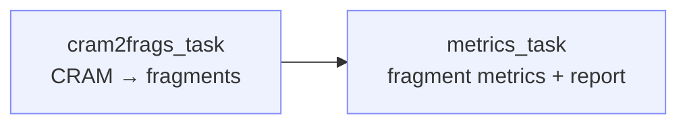

# cram2frags

!!! info "At a glance"
    **Repository:** [atlasxomics/cram2frag_wf](https://github.com/atlasxomics/cram2frag_wf) ·
    **Display name:** cram2frags ·
    **Modality:** Epigenomics · **Stage:** Preprocessing



<p style="text-align:center;font-size:0.75rem;opacity:0.7;margin-top:-0.5rem">
Workflow task DAG — an indexed CRAM is converted to a fragments file, then
summarized by the metrics task.
</p>

## Overview

**cram2frags** converts an **indexed CRAM alignment** into a tabix-indexed
[fragments file](../../reference/glossary.md#fragments-file), producing the same
analysis-ready input as
[ATX epigenomic preprocessing](../preprocessing.md) — but starting from
already-aligned reads rather than raw FASTQ.

Use it when sequencing is delivered as aligned CRAM (e.g. **Ultima** runs)
instead of FASTQ. The resulting fragments file feeds the same downstream
[optimization](../optimize-archr.md) and
[secondary analysis](../create-archrproject.md) Workflows.

!!! note "Single-end, spatially barcoded CRAM"
    The input is an indexed CRAM from **single-end** sequencing whose reads carry
    spatial barcode tags. The CRAM's `.crai` index is required alongside it;
    a `.md5` checksum and a run `.json` are picked up automatically when present.

## Steps

1. **`cram2frags_task`** — Converts the CRAM to fragments. Splits the alignment
   per chromosome and converts to BAM (`batchCRAM2ChrBAM.sh`, parallelized across
   `max_jobs` × `cores_per_job`), optionally dropping reads without an **`a3`
   tag** (`filter_a3`), derives each read's spatial position from its two
   barcodes according to `bc_order`, then sorts, merges, and `bgzip`-compresses
   the fragments (`batchSortFrags_v4.sh`) and builds a **tabix index**. Also
   generates fragment statistics and a chromosome fragment map
   (`fragStats_sum.py`, `chromFragMap.py`).
2. **`metrics_task`** — Computes fragment-level QC from the fragments file
   (`atac_analysis_summary.py`) — per-tixel metrics, peak list, and QC plots —
   and assembles the standalone HTML report (`fragReport.py`). When the run's
   Ultima `.json` is available, it additionally renders an **Ultima sequencing
   report**.

## Inputs

| Parameter | Type | Default | Description |
|---|---|---|---|
| `cram_file` | LatchFile | — | Indexed CRAM alignment from single-end sequencing. Its `.crai` must sit alongside it. |
| `project_name` | str | — | Output folder name. |
| `genome` | enum | `hg38` | Reference genome — `hg38`, `mm10`, or `rnor6`. |
| `bc_order` | enum | `bb,ba` | Spatial barcode order — which barcode is used for **rows** vs. **columns**. |
| `filter_a3` | bool | `True` | Drop reads without an `a3` tag. |

??? note "Compute parameters"
    | Parameter | Default | Description |
    |---|---|---|
    | `cores_per_job` | `4` | Cores allocated per parallel job. |
    | `max_jobs` | `10` | Maximum jobs run in parallel. |

## Outputs

Written to the project's `cram2frags/` directory.

```text
cram2frags/<project_name>/
├── fragments.sort.bed.gz           # the fragments file
├── fragments.sort.bed.gz.tbi       # tabix index
└── frag_metrics/                   # QC metrics & reports
    ├── fragment_analysis_report.html
    ├── fragments_adata_obs.csv
    ├── fragments_peakList.bed.gz
    └── ultima_report.html          # when a run .json is present
```

| File | Description |
|---|---|
| `fragments.sort.bed.gz` | **The fragments file** — BED-like, tab-delimited, `bgzip`-compressed; each row is a fragment. The input to downstream Workflows. |
| `fragments.sort.bed.gz.tbi` | [Tabix](http://www.htslib.org/doc/tabix.html) index for fast coordinate lookup. |
| `frag_metrics/fragment_analysis_report.html` | Self-contained HTML QC report. |
| `frag_metrics/fragments_adata_obs.csv` | Per-tixel (per-barcode) metrics table. |
| `frag_metrics/fragments_peakList.bed.gz` | Called peaks for the run. |
| `frag_metrics/ultima_report.html` | Ultima sequencing-run report, generated when the run's `.json` is available. |

## Example run

*(Representative LaunchPlan / batch-table example to be added.)*
