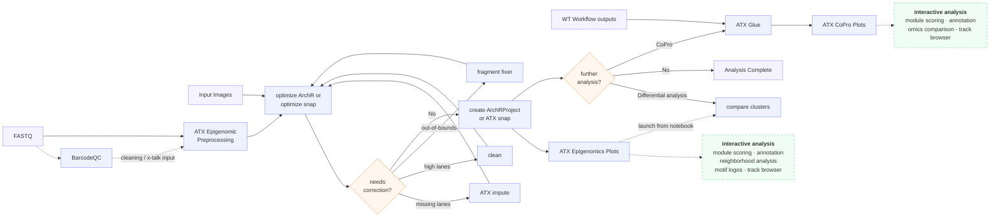

# Epigenomics

The epigenomics path processes spatial **ATAC-seq** and **CUT&Tag** data
generated via DBiT-seq. It takes raw FASTQ and image data through alignment, QC,
parameter optimization, and secondary analysis.

## How the Workflows fit together

**Walking the flow:**

1. **Preprocess.** Raw **FASTQ** goes through [ATX epigenomic
   preprocessing](preprocessing.md) to produce a fragments file. Optionally, run
   [BarcodeQC](../tools/barcodeqc.md) **first** — it generates the
   [cleaning](../reference/glossary.md#cleaning) and
   [cross-talk correction](../reference/glossary.md#cross-talk-correction) tables
   that preprocessing then applies inline.
2. **Optimize.** The fragments file plus the **spatial images** feed
   [optimize archr](optimize-archr.md) or [optimize_snap](optimize-snap.md),
   which sweep parameters and produce the first **spatial maps** of the
   experiment.
3. **Correct if needed.** The spatial maps reveal whether a run needs remediation
   — [ATX impute](helpers/impute.md) for **missing lanes**,
   [clean](helpers/clean.md) for **over-represented ("high") lanes**, or
   [fragment fixer](helpers/fragment-fixer.md) for **out-of-bounds** coordinates.
   After correction, re-optimize; once no correction is needed, proceed.
4. **Secondary analysis.** [create ArchRProject](create-archrproject.md) or
   [ATX_snap](atx-snap.md) builds the analysis-ready objects.
5. **Visualize & branch.** Results are explored in
   [ATX Epigenomics Plots](plots.md) (interactive module scoring, annotation,
   neighborhood analysis, motif logos, track browser). From here you can run
   [compare clusters](compare-clusters.md) for **differential analysis** (also
   launchable from a Plots notebook), finish, or continue to **Co-Profiling** —
   [ATX Glue](../coprofiling/atx-glue.md) combines these outputs with
   [whole-transcriptome](../transcriptome/index.md) results, visualized in
   [ATX CoPro Plots](../coprofiling/plots.md).

!!! note "When do the correction steps run?"
    The correction steps above (impute / clean / fragment fixer) only appear as a
    **post-optimization loop when BarcodeQC is *not* run** — in that case,
    optimization is the first time you get spatial maps, which are what's needed
    to decide whether correction is required.

    - If **BarcodeQC is run**, **cleaning** (and cross-talk correction) is applied
      during [preprocessing](preprocessing.md), so no post-optimization loop is
      needed for it.
    - **Fragment fixer** runs during preprocessing for new runs; only **older
      runs, or fragment files from other pipelines**, need it applied separately.

## Processing path

| Stage | Workflow | Purpose |
|---|---|---|
| **Preprocessing** | [ATX epigenomic preprocessing](preprocessing.md) | Filter, align, and QC raw reads into a fragments file. |
| **Optimization** | [optimize archr](optimize-archr.md), [optimize_snap](optimize-snap.md) | Sweep dimensionality-reduction / clustering parameters. |
| **Secondary Analysis** | [create ArchRProject](create-archrproject.md), [ATX_snap](atx-snap.md) | Produce analysis-ready objects (ArchRProject, AnnData). |
| **Plots** | [Epigenomics Plots](plots.md) | Interactive visualization of results. |

## Helper Workflows

Epigenomics-specific, single-step utilities:

- [atx_convert](helpers/atx-convert.md) — convert between Seurat and H5AD.
- [ATX impute](helpers/impute.md) — fill in missing lanes.
- [clean](helpers/clean.md) — cleaning / cross-talk correction.
- [fragment fixer](helpers/fragment-fixer.md) — screen alignment files for
  out-of-bounds coordinates.

## Advanced Analysis

- [compare clusters](compare-clusters.md) — compare clusters across
  ArchRProjects.
