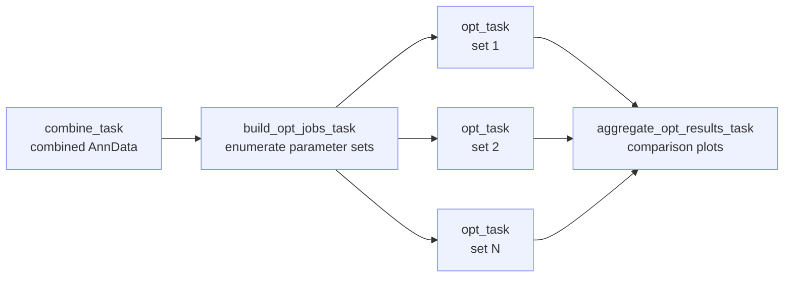

# optimize_snap

!!! info "At a glance"
    **Repository:** [atlasxomics/optimize_snap](https://github.com/atlasxomics/optimize_snap) ·
    **Display name:** optimize_snap ·
    **Modality:** Epigenomics · **Stage:** Optimization



<p style="text-align:center;font-size:0.75rem;opacity:0.7;margin-top:-0.5rem">
Workflow task DAG — the combined object is built once, parameter sets fan out in
parallel, then results are aggregated. (Internal Registry upload omitted.)
</p>

## Overview

**optimize_snap** evaluates the quality of an epigenomic
[DBiT-seq](https://www.nature.com/articles/s41586-022-05094-1) experiment and
tests an array of parameter combinations against analysis outcomes. It is a
preliminary Workflow, run **before** the computationally intensive
[ATX_snap](atx-snap.md) secondary analysis, to inform which parameters to use.

It is the Python-based alternative to [optimize archr](optimize-archr.md):
analysis is performed with [SnapATAC2](https://kzhang.org/SnapATAC2/) and
[Scanpy](https://scanpy.readthedocs.io/) rather than ArchR/Seurat. Given
fragments and spatial information, it returns plots and summary statistics for
each parameter set. All Runs are merged into a single combined AnnData object,
then each parameter combination is evaluated in parallel.

## Steps

1. **`combine_task`** — The shared setup, run **once**. Builds a per-Run AnnData
   for each fragments file, filters cells by minimum fragments (`min_frags`) and
   minimum TSS enrichment (`min_tss`), adds the SnapATAC2 tile matrix
   ([`pp.add_tile_matrix`](https://kzhang.org/SnapATAC2/api/_autosummary/snapatac2.pp.add_tile_matrix.html),
   `bin_size = tile_size`), merges all Runs into `combined.h5ad`, attaches spatial
   coordinates, and renders a TSS-enrichment QC plot. Optionally subsamples cells
   (`subsample_fraction` / `subsample_n_cells` / `subsample_seed`). A precomputed
   object can be supplied via **combined h5ad override**. Every parameter set
   reuses this one object.
2. **`build_opt_jobs_task`** — *(plumbing)* Expands the list-valued parameters
   (`n_features`, `n_comps`, `resolution`, `varfeat_iters`) into the full grid of
   parameter sets to evaluate.
3. **`opt_task`** — The per-set evaluation, **fanned out in parallel** (one task
   per set via `map_task`). On the shared object it selects features
   ([`pp.select_features`](https://kzhang.org/SnapATAC2/api/_autosummary/snapatac2.pp.select_features.html),
   `n_features`), computes the spectral embedding
   ([`tl.spectral`](https://kzhang.org/SnapATAC2/api/_autosummary/snapatac2.tl.spectral.html),
   `n_comps`), clusters with Leiden
   ([`tl.leiden`](https://kzhang.org/SnapATAC2/api/_autosummary/snapatac2.tl.leiden.html),
   `resolution`, `n_iterations = varfeat_iters`, `leiden_iters`,
   `min_cluster_size`), re-attaches spatial coordinates, and writes that set's
   `combined.h5ad`.
4. **`aggregate_opt_results_task`** — Collects every set's object and builds the
   comparison outputs: paginated UMAP embeddings across sets (`all_umaps`),
   spatial cluster maps (`all_spatialdim`), a spatial QC grid
   (`n_fragment`, `log10_frags`, TSS enrichment), and per-run QC medians
   (`medians.csv`), each with a browsable HTML gallery.

## Inputs

**Per Run** (`runs: List[Run]`):

| Field | Type | Description |
|---|---|---|
| `run_id` | str | Identifier for the Run. |
| `fragments_file` | LatchFile | `fragments.tsv.gz` from preprocessing. |
| `spatial_dir` | LatchDir | [Spatial folder](../reference/glossary.md#spatial-folder). |
| `condition` | str | Optional experimental condition (e.g. `control`, `diseased`). |

**Global / swept parameters:**

| Parameter | Type | Default | Description |
|---|---|---|---|
| `genome` | enum | — | Reference genome. |
| `project_name` | str | — | Output folder name. |
| `tile_size` | int | `5000` | Genomic bin size for the tile matrix. |
| `n_features` | List[int] | `[25000]` | *Swept.* Most-accessible tiles used for analysis. |
| `n_comps` | List[int] | `[30]` | *Swept.* Spectral-embedding dimensions. |
| `resolution` | List[float] | `[1.0]` | *Swept.* Leiden clustering resolution. |
| `varfeat_iters` | List[int] | `[1]` | *Swept.* Iterative feature-selection rounds (`1` = none). |
| `combined_h5ad_override` | LatchFile | — | Optional precomputed `combined.h5ad`. |

??? note "Hidden / advanced parameters"
    | Parameter | Default | Description |
    |---|---|---|
    | `leiden_iters` | `-1` | Leiden iterations (`-1` = until convergence). |
    | `min_cluster_size` | `20` | Minimum cells per cluster. |
    | `min_tss` | `2.0` | Minimum TSS enrichment per cell. |
    | `min_frags` | `10` | Minimum fragments per cell. |
    | `subsample_fraction` | — | Fraction of cells to retain (0–1). |
    | `subsample_n_cells` | — | Absolute number of cells to retain. |
    | `subsample_seed` | `42` | Random seed for subsampling. |
    | `pt_size` | — | Override cluster spatial-plot point size. |
    | `qc_pt_size` | — | Override QC spatial-plot point size. |

## Outputs

Written to `latch:///snap_opts/<project_name>/`.

```text
snap_opts/<project_name>/
├── combined.h5ad
├── combined_ds.h5ad                # only when subsampling
├── medians.csv
├── all_umaps.html                  # browsable galleries
├── all_spatialdim.html
├── spatial_qc.html
├── subsample_info.txt              # only when subsampling
├── figures/
│   ├── all_umaps.png
│   ├── all_spatialdim.png
│   ├── spatial_qc.png
│   └── tss_frags.png
└── _intermediate/                  # shared object + _mapped_sets/<set>/, logs/
```

| Path | Description |
|---|---|
| `combined.h5ad` | The combined AnnData object (tile matrix, cell filters, spatial coordinates). |
| `combined_ds.h5ad` | Subsampled combined object — only when subsampling is enabled. |
| `medians.csv` | Per-run QC medians (median fragments per cell, median TSS enrichment). |
| `figures/all_umaps.png` | UMAP embeddings for every parameter set — one page per set. |
| `figures/all_spatialdim.png` | Spatial cluster maps for every parameter set. |
| `figures/spatial_qc.png` | Spatial QC grid (`n_fragment`, `log10_frags`, TSS enrichment) per Run. |
| `figures/tss_frags.png` | TSS-enrichment vs. fragments QC plot. |
| `all_umaps.html`, `all_spatialdim.html`, `spatial_qc.html` | Browsable HTML galleries paging through the figures above, for side-by-side comparison of sets. |
| `subsample_info.txt` | Subsampling summary — only when subsampling is enabled. |

Intermediate artifacts (the shared combined object and each set's `combined.h5ad`)
are kept under `latch:///snap_opts/<project_name>/_intermediate/` (per-set outputs
in `_mapped_sets/<set>/`), with performance logs under `logs/`. Use the galleries
and medians to choose the parameter set to carry into [ATX_snap](atx-snap.md).

!!! note "Internal step"
    A final `registry_task` writes outputs to the Latch Registry (see
    [Internal Tasks](../getting-started/platform-overview.md#internal-atx-only-tasks)).

## Example run

*(Representative LaunchPlan / batch-table example to be added.)*
