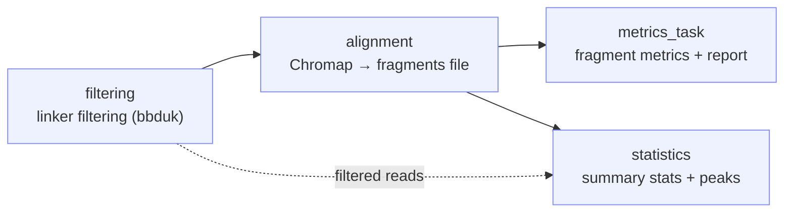

# ATX epigenomic preprocessing

!!! info "At a glance"
    **Repository:** [atlasxomics/atlasXomics_pipeline_wf](https://github.com/atlasxomics/atlasXomics_pipeline_wf) ·
    **Display name:** ATX epigenomic preprocessing ·
    **Modality:** Epigenomics · **Stage:** Preprocessing



<p style="text-align:center;font-size:0.75rem;opacity:0.7;margin-top:-0.5rem">
Workflow task DAG — reads are linker-filtered, aligned into a fragments file,
then summarized by the metrics and statistics tasks. (Internal Registry/SLIMS
upload tasks omitted.)
</p>

## Overview

The ATX epigenomic preprocessing Workflow takes raw spatial ATAC-seq / CUT&Tag
data — generated via [DBiT-seq](https://www.nature.com/articles/s41586-023-05795-1)
— from FASTQ files to an analysis-ready, tabix-indexed **fragments file** with
quality-control reports.

The Workflow expects the DBiT-seq barcoding schema for Illumina short-read
sequencing:

- **read 1**: genomic sequence
- **read 2**: `linker1 | barcodeA | linker2 | barcodeB | genomic sequence`

The resulting fragments file can be used directly by downstream tools such as
[ArchR](https://www.archrproject.com/) and [Signac](https://stuartlab.org/signac/),
and feeds the [optimization](optimize-archr.md) and
[secondary analysis](create-archrproject.md) Workflows.

## Steps

1. **`filtering`** — Filter reads on read 2 ligation-linker sequences with
   [bbduk](https://jgi.doe.gov/data-and-tools/software-tools/bbtools/). Reads
   with more than 3 mismatches in linker 1 or linker 2 are removed (each can be
   skipped independently). Supports optional
   [cleaning](../reference/glossary.md#cleaning) /
   [cross-talk correction](../reference/glossary.md#cross-talk-correction) and
   [bulk](../reference/glossary.md#bulk-mode) /
   [no-ligation-bulk](../reference/glossary.md#no-ligation-bulk-mode) modes.
2. **`alignment`** — Align filtered read pairs with
   [Chromap](https://github.com/haowenz/chromap), assigning barcodes from read 2,
   and build a fragments file. Post-processing suffixes barcodes with `-1`,
   removes out-of-bounds fragments using genome chromosome sizes, and optionally
   applies blacklist filtering and cross-talk correction.
3. **`metrics_task`** — Compute fragment-level QC and build a standalone report.
   Runs `atac_analysis_summary_prep.py` (with the genome's GENCODE annotation and
   chromosome sizes; `--min-fragments 100`) to derive per-tixel metrics —
   fragment count, TSS enrichment, FRIP, fragment-size distribution, and
   duplication / mitochondrial rates — and to produce a coverage bigWig, a peak
   list, and the QC histograms. It then generates a spatial **lane QC** plot from
   the tissue positions and assembles everything into an HTML report
   (`fragReport.py`). Outputs land in `chromap_output/frag_metrics/`.
4. **`statistics`** — Produce run-level summary statistics and (optionally) call
   peaks. Runs `pycis.py` ([pycisTopic](https://pycistopic.readthedocs.io/)) for
   per-cell QC (`cistopic_cell_data.csv`), TSS enrichment against the genome TSS
   annotation, and — when `peak_calling` is enabled — MACS-based consensus peak
   calling (`consensus_regions.bed`, `<run_id>_peaks.bed`) plus `qc_plot.pdf`.
   `singlecellsummary.py` then rolls these into the run-level `summary.csv` (the
   row pushed to the Registry) and per-barcode `singlecell.csv`. If pycisTopic
   fails, the summary step is skipped. Outputs land in `Statistics/`.

## Inputs

| Parameter | Type | Description |
|---|---|---|
| `run_id` | str | ATX run ID (`Dxxxxx_NGxxxxx`). |
| `r1` | LatchFile | Read 1 FASTQ (`.fastq.gz`). |
| `r2` | LatchFile | Read 2 FASTQ (`.fastq.gz`). |
| `species` | LatchDir | Chromap genome reference directory. |
| `barcode_file` | enum | Barcode whitelist / schema. |
| `peak_calling` | bool | Perform peak calling during QC. |
| `bulk`, `noLigation_bulk` | bool | [Bulk](../reference/glossary.md#bulk-mode) / [no-ligation-bulk](../reference/glossary.md#no-ligation-bulk-mode) processing modes (non-spatial runs). |
| `skip1`, `skip2` | bool | Skip linker 1 / linker 2 filtering. |
| `blacklist_filtering` | bool | Apply blacklist filtering. |
| `cleaning`, `xtalk_correction` | bool | Apply cleaning / cross-talk correction. |
| `ds_table` | LatchFile | Correction table (cleaning / cross-talk). |
| `xtalk_threshold` | float | Cross-talk fold threshold. |

*(Internal-only parameters — `upload_to_slims`, `ng_id`, `table_id`,
`skip_registry` — are omitted here; see Internal Tasks.)*

## Outputs

All outputs are written under `latch:///chromap_outputs/<run_id>/`. Note that
**`frag_metrics/` is nested inside `chromap_output/`** (not a top-level
sibling):

```text
chromap_outputs/<run_id>/
├── preprocessing/          # filtered reads
├── chromap_output/         # alignment
│   └── frag_metrics/       # fragment metrics & report
└── Statistics/             # summary statistics & peaks
```

### `preprocessing/` — filtered reads

The linker-filtered FASTQs and filtering statistics from the `filtering` task
(bbduk). These are the reads actually passed to alignment.

| File | Description |
|---|---|
| `<run_id>_S1_L001_R1_001.fastq.gz` | Linker-filtered **read 1**, renamed to standard Illumina lane naming. |
| `<run_id>_linker2_R2.fastq.gz` | Linker-filtered **read 2** (surviving both linker-1 and linker-2 filtering). |
| `<run_id>_l1_stats.txt` | bbduk stats for the linker-1 filtering pass (reads matched / removed). |
| `<run_id>_l2_stats.txt` | bbduk stats for the linker-2 filtering pass. |

### `chromap_output/` — alignment

The core alignment products from the `alignment` task.

| File | Description |
|---|---|
| `fragments.tsv.gz` | **The fragments file** — a BED-like, tab-delimited, `bgzip`-compressed table where each row is an ATAC-seq fragment (chrom, start, end, barcode, count). The primary input to all downstream Workflows. When cross-talk correction is applied this is named `fragments.final.tsv.gz`. |
| `fragments.tsv.gz.tbi` | [Tabix](http://www.htslib.org/doc/tabix.html) index for the fragments file, enabling fast random access by genomic coordinate. |
| `aln.bed` | Raw Chromap BED alignment output (pre fragment-file post-processing). |
| `chromap_log.txt` | Chromap run log — alignment rate, duplicate rate, and other run diagnostics. |

### `chromap_output/frag_metrics/` — fragment metrics & report

Nested inside `chromap_output/`. Per-cell metrics, QC plots, and a standalone
report from the `metrics_task` (`atac_analysis_summary_prep.py` +
`fragReport.py`).

| File | Description |
|---|---|
| `fragment_analysis_report.html` | Self-contained HTML QC report summarizing the metrics and plots below. |
| `fragments_adata_obs.csv` | Per-tixel (per-barcode) metrics table — fragment counts, TSS enrichment, FRIP, duplication and mitochondrial rates. The canonical single-cell metrics file. |
| `fragments_peakList.bed.gz` / `fragments_peaks.bed` | Called peaks / peak list for the run. |
| `fragments_cell.bw` | Aggregated coverage track ([bigWig](https://genome.ucsc.edu/goldenPath/help/bigWig.html)) for genome-browser visualization. |
| `fragments_frip_hist.png` | Distribution of FRIP (fraction of reads in peaks) across tixels. |
| `fragments_tsse.png` / `fragments_norm_tss.png` | TSS-enrichment distribution and normalized TSS profile. |
| `fragments_frag_size.png` | Fragment-size distribution (nucleosome banding). |
| `fragments_dup_hist.png` | Duplication-rate distribution. |
| `fragments_mito_hist.png` | Mitochondrial-fraction distribution. |
| `fragments_frag_v_dup.png` | Fragments vs. duplication scatter. |
| `lane_qc.png` / `lane_qc.pdf` | Spatial lane QC plot — per-row/column fragment counts used to spot failed lanes. |
| `run_id.txt` | The run ID (used by the report). |
| `chromap_log.txt` | Copy of the Chromap log. |

### `Statistics/` — summary statistics & peaks

Run-level summary and peak calling from the `statistics` task (pycisTopic +
`singlecellsummary.py`).

| File | Description |
|---|---|
| `summary.csv` | Run-level summary metrics (median fragments, TSS, FRIP, tixel counts, etc.) — the row pushed to the Registry. |
| `singlecell.csv` | Per-barcode single-cell summary table. |
| `cistopic_cell_data.csv` | pycisTopic per-cell QC data. |
| `qc_plot.pdf` | pycisTopic QC plots. |
| `<run_id>_peaks.bed` | Peaks called for the run. |
| `scATAC/consensus_peak_calling/consensus_regions.bed` | Consensus peak regions from pycisTopic. |

!!! note "Return value"
    The Workflow function returns the handles `[aln.bed, fragments.tsv.gz,
    chromap_log.txt, fragments.tsv.gz.tbi, Statistics/, frag_metrics/]`; the
    individual files above live inside those directories.

## Example run

```python
LaunchPlan(
    total_wf,
    "demo",
    {
        "r1": LatchFile("s3://latch-public/test-data/13502/atx_demo_R1_001.fastq.gz"),
        "r2": LatchFile("s3://latch-public/test-data/13502/atx_demo_R2_001.fastq.gz"),
        "run_id": "demo",
        "barcode_file": BarcodeFile.x50,
        "species": LatchDir("latch:///Chromap_references/Human"),
    },
)
```
