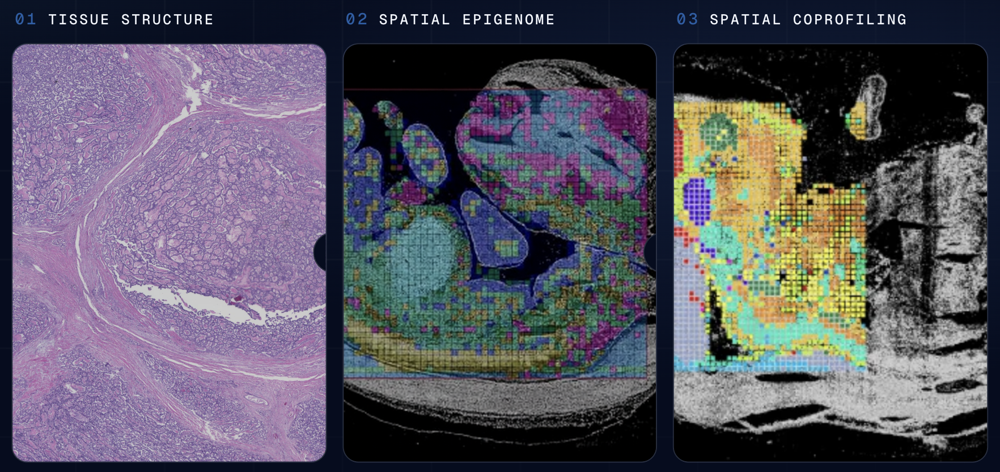
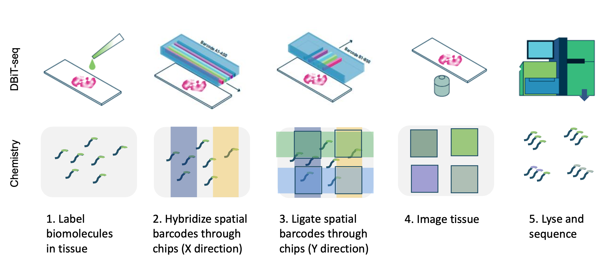

# AtlasXomics Documentation



Welcome to the documentation for the **AtlasXomics (ATX)** spatial-omics data
processing platform. AtlasXomics has developed a suite of tools that enable
scientists to process spatial-omics data both **on the cloud** and **locally**.
Here we provide comprehensive, end-to-end documentation for that platform.

## What this platform does



Raw data consists of **FASTQ** and **image** files. From these, ATX supports two
primary processing paths and an optional combined path:

- **Epigenomics** — spatial ATAC-seq and CUT&Tag
- **Whole Transcriptome** — spatial RNA-seq
- **Co-Profiling** — an optional path that combines epigenomic and
  transcriptomic secondary outputs

Our standard processing pipeline runs on the **LatchBio** cloud platform.
Outputs are stored in the **Latch File system** (*Latch Data*) and visualized in
**Plots**. Image data can be processed with **AtlasXBrowser** on a Latch Pod or
locally. We also provide guidance for **"DIY"** processing on a local machine.

## Data flow at a glance

```text
    FASTQ                                images
      │                                    │
      ▼                                    ▼
 Preprocessing / QC                   AtlasXBrowser
      │                                    │
      ▼                                    ▼
 Optimization (parameter sweeps) ◄──── spatial folder
      │
      ▼
 Secondary analysis (ArchRProject, AnnData, Seurat)
      │
      ├──────────────► Plots (visualization)
      │
      ▼
 Co-Profiling (optional)   (epigenome × transcriptome)
```

## Where to start

<div class="grid cards" markdown>

- **[Platform Overview](getting-started/platform-overview.md)**
  How the cloud platform, Latch Data, Plots, and the Registry fit together.

- **[Epigenomics](epigenomics/index.md)**
  Preprocess, optimize, and analyze spatial ATAC-seq / CUT&Tag data.

- **[Whole Transcriptome](transcriptome/index.md)**
  QC and secondary analysis for spatial RNA-seq data.

- **[Co-Profiling](coprofiling/index.md)**
  Integrate epigenomic and transcriptomic outputs.

</div>

## Tutorials

For detailed, click-through tutorials on running Workflows and tools in Latch for
ATX data, see our Scribe collection:
**[AtlasXomics / LatchBio Tutorials](https://scribehow.com/o/01jzlMHMRV-kYMeF_qMI2Q/page/AtlasXomics_LatchBio_Tutorials__yUhN8xU7TrOmEcrhks-n3A?referrer=documents)**.

---

*Maintained by [AtlasXomics, Inc.](https://github.com/atlasxomics)*
