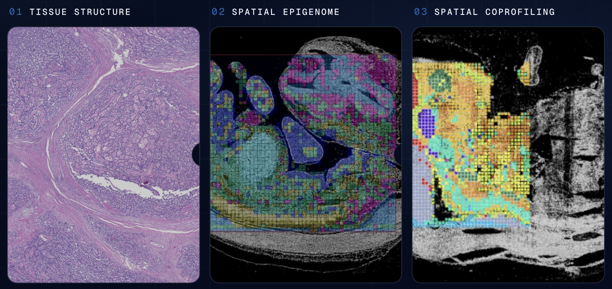
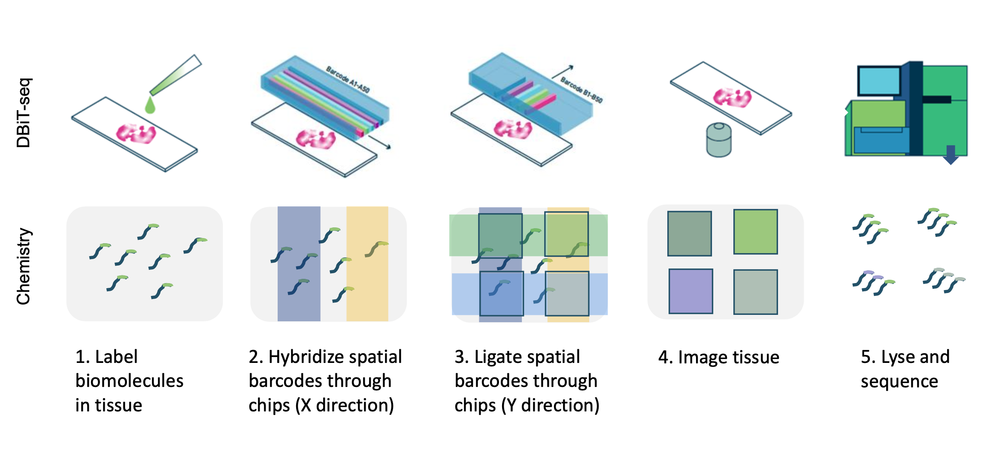

# AtlasXomics Documentation



Welcome to the documentation for the **AtlasXomics (ATX)** spatial-omics data
processing platform. AtlasXomics has developed a suite of tools that enable
scientists to process spatial-omics data both **on the cloud** and **locally**.
Here we provide comprehensive, end-to-end documentation for that platform.

## Platform overview



Raw data consists of **FASTQ** and **image** files. From these, ATX supports two
primary processing paths and an optional combined path:

- **Epigenomics** — spatial ATAC-seq and CUT&Tag
- **Whole Transcriptome** — spatial RNA-seq
- **Co-Profiling** — an optional path that combines epigenomic and
  transcriptomic secondary outputs

Our standard processing pipeline runs on the [**LatchBio**](https://latch.bio/) cloud platform.
Outputs are stored in the **Latch File system** ([*Latch Data*](https://wiki.latch.bio/data/overview)) and visualized in
[**Plots**](https://wiki.latch.bio/plots/overview). Image data can be processed with [**AtlasXBrowser**](https://atlasxbrowser-docs.readthedocs.io/en/latest/index.html) on a Latch Pod or
locally. We also provide guidance for [**"DIY"**](tools/diy.md) processing on a local machine.

## Data flow at a glance

```text
    FASTQ                                images
      │                                    │
      ▼                                    ▼
 Preprocessing / QC                   AtlasXBrowser
      │                                    │
      ▼                                    ▼
 Optimization (parameter sweeps) ◄──── spatial folder
      │
      ▼
 Secondary analysis (ArchRProject, AnnData, Seurat)
      │
      ├──────────────► Plots (visualization)
      │
      ▼
 Co-Profiling (optional)   (epigenome × transcriptome)
```

Every modality (Epigenomics, Whole Transcriptome, Co-Profiling) follows the same
overall shape. We use consistent stage names throughout this documentation:

1. **Preprocessing / QC** — *primary analysis*: alignment and QC of FASTQ files,
   and processing of image data.
2. **Optimization** — parameter sweeps that evaluate multiple
   dimensionality-reduction / clustering settings in parallel to inform final
   processing.
3. **Secondary analysis** — post-alignment processing that moves aligned data
   toward more meaningful context: gene accessibility, peak calling, and motif
   deviations (epigenomic), clustering, cell typing, and spatial analysis, plus
   generation of objects (ArchRProject, AnnData, Seurat) for downstream work.
4. **Plots** — interactive visualization of the results.

## Tutorials

Step-by-step, click-through tutorials for running ATX Workflows and tools on
Latch are maintained in Scribe.

- **[AtlasXomics / LatchBio Tutorials (collection)](https://scribehow.com/o/01jzlMHMRV-kYMeF_qMI2Q/page/AtlasXomics_LatchBio_Tutorials__yUhN8xU7TrOmEcrhks-n3A?referrer=documents)**
- **[Running AtlasXBrowser](https://scribehow.com/o/01jzlMHMRV-kYMeF_qMI2Q/viewer/Running_AtlasXBrowser__8Wp0TTJ7SRW85_-vbGe5SA)**
- **[DIY processing of Epigenomic data](https://github.com/atlasxomics/ATX_epigenomics)**


## Where to start

<div class="grid cards" markdown>

- **[Epigenomics](epigenomics/index.md)**
  Preprocess, optimize, and analyze spatial ATAC-seq / CUT&Tag data.

- **[Whole Transcriptome](transcriptome/index.md)**
  QC and secondary analysis for spatial RNA-seq data.

- **[Co-Profiling](coprofiling/index.md)**
  Integrate epigenomic and transcriptomic outputs.

- **[Glossary](reference/glossary.md)**
  Latch platform concepts and ATX-specific terms, defined.

</div>

---

*Maintained by [AtlasXomics, Inc.](https://github.com/atlasxomics)*
