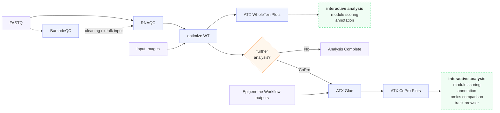

# Whole Transcriptome

The whole transcriptome path processes spatial **RNA-seq** data generated via
DBiT-seq, from raw reads through QC and secondary analysis.

## How the workflows fit together

**Walking the flow:**

1. **Preprocess & QC.** Raw **FASTQ** goes through [RNAQC](rnaqc.md) — STARsolo
   alignment, a MultiQC report, and a FastQ-Screen contamination check —
   producing the per-run gene-expression matrix. As on the
   epigenomics path, you can optionally run [BarcodeQC](../tools/barcodeqc.md)
   **first** to generate the [cleaning](../reference/glossary.md#cleaning) and
   [cross-talk correction](../reference/glossary.md#cross-talk-correction) tables
   that QC then applies.
2. **Optimize (secondary analysis).** The QC'd reads plus the **spatial images**
   feed [optimize_wt](optimize-wt.md), which filters and normalizes, selects
   highly variable genes, optionally integrates with Harmony, clusters via
   [Scanpy](https://scanpy.readthedocs.io/) or
   [STAGATE](https://github.com/zhanglabtools/STAGATE), and computes marker
   genes. Unlike the epigenomics path, there is no separate object-creation step
   — `optimize_wt` **is** the whole-transcriptome secondary analysis.
3. **Visualize & branch.** Results are explored in
   [ATX WholeTxn Plots](plots.md) (interactive module scoring and annotation).
   From the `further analysis?` decision you either finish, or continue to
   **Co-Profiling** — [ATX Glue](../coprofiling/atx-glue.md) combines these
   transcriptome outputs with [epigenome](../epigenomics/index.md) outputs,
   visualized in [ATX CoPro Plots](../coprofiling/plots.md) (module scoring,
   annotation, omics comparison, track browser).

## Processing path

| Stage | Workflow | Purpose |
|---|---|---|
| **Preprocessing** | [RNAQC](rnaqc.md) | STARsolo alignment, QC report, and contamination screening. |
| **Secondary Analysis** | [optimize_wt](optimize-wt.md) | Preprocessing, integration, clustering, and marker genes. |
| **Plots** | [Transcriptome Plots](plots.md) | Interactive visualization of results. |
