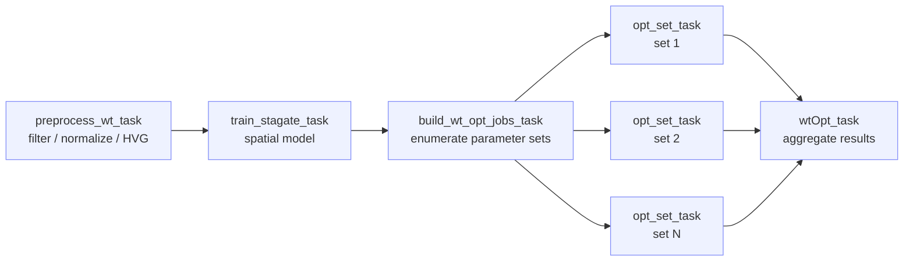

# optimize_wt

!!! info "At a glance"
    **Repository:** [atlasxomics/optimize_wt](https://github.com/atlasxomics/optimize_wt) ·
    **Display name:** optimize_wt ·
    **Modality:** Whole Transcriptome · **Stage:** Secondary Analysis



<p style="text-align:center;font-size:0.75rem;opacity:0.7;margin-top:-0.5rem">
Workflow task DAG — reads are preprocessed and a spatial model trained, then
parameter sets fan out in parallel before results are aggregated.
</p>

## Overview

**optimize_wt** is the whole-transcriptome secondary analysis Workflow. It
preprocesses spatial RNA-seq data and sweeps clustering parameters, using either
[Scanpy](https://scanpy.readthedocs.io/) (Leiden) or
[STAGATE](https://github.com/zhanglabtools/STAGATE) (spatial graph-attention
embedding), with optional [Harmony](https://github.com/immunogenomics/harmony)
batch integration and cluster-marker computation. All Runs are combined into a
single object, preprocessed once, then each parameter set is evaluated in
parallel.

## Steps

1. **`preprocess_wt_task`** — The shared setup, run **once**. Combines the Runs,
   applies QC cell filters (`min_genes`, `min_cells`, `min_counts`, `max_counts`,
   `max_pct_mt`), adds spatial neighbors, normalizes
   ([`normalize_total`](https://scanpy.readthedocs.io/) → `normalize_target_sum`,
   then `log1p`), selects highly variable genes (`n_top_genes`, `hvg_flavor`),
   and scales. Writes `preprocessed.h5ad`.
2. **`train_stagate_task`** — Only when `clustering_backend = "stagate"`: trains
   the STAGATE spatial graph-attention embedding (`stagate_k_cutoff`, optional
   Harmony) on a **GPU**. With the Scanpy backend the preprocessed object passes
   through unchanged.
3. **`build_wt_opt_jobs_task`** — *(plumbing)* Expands the swept lists into the
   parameter grid — `resolution × n_comps × n_neighbors` for Scanpy, or
   `resolution × n_neighbors` for STAGATE.
4. **`opt_set_task`** — The per-set evaluation, **fanned out in parallel** (one
   task per set via `map_task`). Clusters the shared object — Scanpy (Leiden with
   `resolution`, `n_comps`, `n_neighbors`, `min_dist`, `spread`, optional Harmony,
   `merge_small_clusters`) or STAGATE — optionally computes cluster markers
   (`rank_genes_groups` → `deg_clusters.csv`), and writes that set's
   `combined_sm.h5ad`.
5. **`wtOpt_task`** — Aggregates every set into the comparison outputs: UMAP,
   spatial, and QC galleries, spatial-coherence and spatially-variable-gene
   results, per-run QC medians, and a Latch Plots artifact.

## Inputs

**Per Run** (`runs: List[Run]`):

| Field | Type | Description |
|---|---|---|
| `run_id` | str | Identifier for the Run. |
| `gex_dir` | LatchDir | Gene-expression directory (STARsolo output) for the Run. |
| `spatial_dir` | LatchDir | [Spatial folder](../reference/glossary.md#spatial-folder). |
| `condition` | str | Optional experimental condition (e.g. `control`, `diseased`). |

**Global / swept parameters:**

| Parameter | Type | Default | Description |
|---|---|---|---|
| `genome` | enum | — | Reference genome. |
| `project_name` | str | — | Output folder name. |
| `clustering_backend` | str | `scanpy` | `scanpy` (Leiden) or `stagate`. |
| `resolution` | List[float] | `[1.0]` | *Swept.* Clustering resolution. |
| `n_comps` | List[int] | `[30]` | *Swept.* Number of components (Scanpy only). |
| `n_neighbors` | List[int] | `[15]` | *Swept.* Neighborhood size. |
| `n_top_genes` | int | `4000` | Highly variable genes to select. |
| `hvg_flavor` | str | `seurat` | HVG method: `seurat`, `cell_ranger`, `seurat_v3`, … |
| `apply_harmony` | bool | `True` | Apply Harmony batch integration. |

??? note "Hidden / advanced parameters"
    | Parameter | Default | Description |
    |---|---|---|
    | `stagate_k_cutoff` | `4` | STAGATE spatial-graph k cutoff. |
    | `min_dist` | `0.05` | UMAP minimum distance. |
    | `spread` | `0.5` | UMAP spread. |
    | `min_genes` | `30` | Minimum genes per cell. |
    | `min_cells` | `500` | Minimum cells per gene. |
    | `min_counts` | `50` | Minimum counts per cell. |
    | `max_counts` | `0` | Maximum counts per cell (`0` = no cap). |
    | `max_pct_mt` | `100.0` | Maximum mitochondrial percent. |
    | `merge_small_clusters` | `200` | Merge clusters below this size. |
    | `compute_cluster_markers` | `True` | Compute per-cluster marker genes. |
    | `marker_top_n` | `50` | Marker genes reported per cluster. |
    | `normalize_target_sum` | `4000.0` | Target sum for total-count normalization. |
    | `pt_size`, `qc_pt_size` | — | Override cluster / QC spatial-plot point sizes. |

## Outputs

Written to `latch:///wt_opts/<project_name>/`.

```text
wt_opts/<project_name>/
├── combined.h5ad                   # full
├── combined_sm.h5ad                 # reduced (Plots only)
├── medians.csv, metadata.csv
├── deg_clusters.csv, svg_genes.csv
├── figures/
│   ├── all_umaps.png, all_spatialdim.png, spatial_qc.png
│   ├── spatial_coherence.png / .csv, svg_spatial.png
│   └── *.html                    # browsable galleries
├── Launch_Plots/artifact.json
├── <set>/                        # per-parameter-set objects
└── _intermediates/               # shared preprocessed object
```

| Path | Description |
|---|---|
| `combined.h5ad` | The **full** combined, clustered AnnData object — use this for any downstream calculation. |
| `combined_sm.h5ad` | The **reduced (`_sm`)** object loaded by [Transcriptome Plots](plots.md) — see the note below. |
| `medians.csv` | Per-run QC medians. |
| `metadata.csv` | The parameters set for this run. |
| `deg_clusters.csv` | Per-cluster differential-expression markers (`rank_genes_groups`). |
| `svg_genes.csv` | Spatially variable genes. |
| `figures/all_umaps.png` | UMAP embeddings for every parameter set — one page per set. |
| `figures/all_spatialdim.png` | Spatial cluster maps for every parameter set. |
| `figures/spatial_qc.png` | Spatial QC grid per Run. |
| `figures/spatial_coherence.png` / `spatial_coherence.csv` | Spatial-coherence score of the clustering. |
| `figures/svg_spatial.png` | Spatial maps of the top spatially variable genes. |
| `*.html` galleries | Browsable versions of the figures above (`all_umaps`, `all_spatialdim`, `spatial_qc`, `svg_spatial`). |
| `Launch_Plots/artifact.json` | Latch Plots artifact for opening the result in the Transcriptome Plots template. |

!!! warning "Don't compute on the reduced (`_sm`) object"
    `combined_sm.h5ad` is built for fast loading in [Plots](plots.md):
    `make_small_anndata` strips the raw counts (`.raw`), extra `layers` and
    `varm`, and all but a small set of grouping / QC `obs` / `var` columns,
    keeping only the feature matrix, the UMAP embedding, and spatial coordinates.
    **Most importantly, the feature matrix `.X` is cast to `float16`** — so the
    (originally integer) counts lose precision and are no longer exact.

    Because of the `float16` coercion (and the removed raw counts / layers), the
    `_sm` object is **for visualization only** — do **not** use it for downstream
    calculations (differential expression, marker detection, re-clustering, etc.).
    Use the full `combined.h5ad` for those.

Per-set objects are kept under `latch:///wt_opts/<project_name>/<set>/`, and the
shared preprocessed object under `_intermediates/`.

## Example run

*(Representative LaunchPlan / batch-table example to be added.)*
