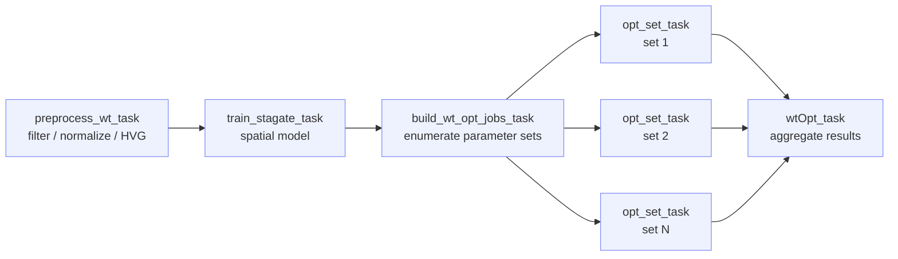

# optimize_wt

!!! info "At a glance"
    **Repository:** [atlasxomics/optimize_wt](https://github.com/atlasxomics/optimize_wt) ·
    **Display name:** optimize_wt ·
    **Modality:** Whole Transcriptome · **Stage:** Secondary Analysis


```mermaid
flowchart LR
    PRE["preprocess_wt_task<br/>filter / normalize / HVG"]:::process
    STAGATE["train_stagate_task<br/>spatial model"]:::process
    BUILD["build_wt_opt_jobs_task<br/>enumerate parameter sets"]:::process
    SET1["opt_set_task<br/>set 1"]:::process
    SET2["opt_set_task<br/>set 2"]:::process
    SETN["opt_set_task<br/>set N"]:::process
    WTOPT["wtOpt_task<br/>aggregate results"]:::process

    PRE --> STAGATE --> BUILD
    BUILD --> SET1 & SET2 & SETN
    SET1 & SET2 & SETN --> WTOPT

    classDef process stroke:#818cf8,fill:#eef2ff
```

<p style="text-align:center;font-size:0.75rem;opacity:0.7;margin-top:-0.5rem">
Workflow task DAG — reads are preprocessed and a spatial model trained, then
parameter sets fan out in parallel before results are aggregated.
</p>

## Overview

**optimize_wt** is the whole-transcriptome secondary analysis Workflow. It
preprocesses spatial RNA-seq data and sweeps clustering parameters, using either
[Scanpy](https://scanpy.readthedocs.io/) (Leiden) or
[STAGATE](https://github.com/zhanglabtools/STAGATE) (spatial graph-attention
embedding), with optional [Harmony](https://github.com/immunogenomics/harmony)
batch integration and cluster-marker computation. All Runs are combined into a
single object, preprocessed once, then each parameter set is evaluated in
parallel.

## Steps

1. **`preprocess_wt_task`** — The shared setup, run **once**. Combines the Runs,
   applies QC cell filters (`min_genes`, `min_cells`, `min_counts`, `max_counts`,
   `max_pct_mt`), adds spatial neighbors, normalizes
   ([`normalize_total`](https://scanpy.readthedocs.io/) → `normalize_target_sum`,
   then `log1p`), selects highly variable genes (`n_top_genes`, `hvg_flavor`),
   and scales. Writes `preprocessed.h5ad`.
2. **`train_stagate_task`** — Only when `clustering_backend = "stagate"`: trains
   the STAGATE spatial graph-attention embedding (`stagate_k_cutoff`, optional
   Harmony) on a **GPU**. With the Scanpy backend the preprocessed object passes
   through unchanged.
3. **`build_wt_opt_jobs_task`** — *(plumbing)* Expands the swept lists into the
   parameter grid — `resolution × n_comps × n_neighbors` for Scanpy, or
   `resolution × n_neighbors` for STAGATE.
4. **`opt_set_task`** — The per-set evaluation, **fanned out in parallel** (one
   task per set via `map_task`). Clusters the shared object — Scanpy (Leiden with
   `resolution`, `n_comps`, `n_neighbors`, `min_dist`, `spread`, optional Harmony,
   `merge_small_clusters`) or STAGATE — computes **neighborhood enrichment** for
   the set (see below), optionally computes cluster markers (`rank_genes_groups`
   → `deg_clusters.csv`), and writes that set's own output directory with both
   `combined.h5ad` and `combined_sm.h5ad`.
5. **`wtOpt_task`** — Aggregates every set into the comparison outputs: UMAP,
   spatial, neighborhood-enrichment, and QC galleries, spatial-coherence and
   spatially-variable-gene results, and per-run QC medians.

### Neighborhood enrichment

For each successful parameter set the Workflow builds a **within-sample spatial
neighbor graph** ([`squidpy.gr.spatial_neighbors`](https://squidpy.readthedocs.io/en/stable/api/squidpy.gr.spatial_neighbors.html))
and runs [`squidpy.gr.nhood_enrichment`](https://squidpy.readthedocs.io/en/stable/api/squidpy.gr.nhood_enrichment.html)
on the cluster labels. This scores, by permutation test, which pairs of clusters
sit next to each other in tissue more (or less) often than chance — turning the
clustering into a statement about **spatial organization** rather than
expression alone.

The result is a cluster × cluster z-score matrix, stored in the set's object
under `uns["cluster_nhood_enrichment"]` and rendered as a heatmap. Enrichment is
also **precomputed per sample and per condition** when those groups have more
than one value, so Plots can show subsets without recomputing. Sets with fewer
than two clusters are skipped.

Alongside it, `spatial_coherence.csv` scores how spatially contiguous each set's
clusters are — together these give a spatial criterion for choosing a parameter
set, next to the visual UMAP/spatial comparison.

## Inputs

**Per Run** (`runs: List[Run]`):

| Field | Type | Description |
|---|---|---|
| `run_id` | str | Identifier for the Run. |
| `gex_dir` | LatchDir | Gene-expression directory (STARsolo output) for the Run. |
| `spatial_dir` | LatchDir | [Spatial folder](../reference/glossary.md#spatial-folder). |
| `condition` | str | Optional experimental condition (e.g. `control`, `diseased`). |

**Global / swept parameters:**

| Parameter | Type | Default | Description |
|---|---|---|---|
| `genome` | enum | — | Reference genome. |
| `project_name` | str | — | Output folder name. |
| `clustering_backend` | str | `scanpy` | `scanpy` (Leiden) or `stagate`. |
| `resolution` | List[float] | `[1.0]` | *Swept.* Clustering resolution. |
| `n_comps` | List[int] | `[30]` | *Swept.* Number of components (Scanpy only). |
| `n_neighbors` | List[int] | `[15]` | *Swept.* Neighborhood size. |
| `n_top_genes` | int | `4000` | Highly variable genes to select. |
| `hvg_flavor` | str | `seurat` | HVG method: `seurat`, `cell_ranger`, `seurat_v3`, … |
| `apply_harmony` | bool | `True` | Apply Harmony batch integration. |

??? note "Hidden / advanced parameters"
    | Parameter | Default | Description |
    |---|---|---|
    | `stagate_k_cutoff` | `4` | STAGATE spatial-graph k cutoff. |
    | `min_dist` | `0.05` | UMAP minimum distance. |
    | `spread` | `0.5` | UMAP spread. |
    | `min_genes` | `30` | Minimum genes per cell. |
    | `min_cells` | `500` | Minimum cells per gene. |
    | `min_counts` | `50` | Minimum counts per cell. |
    | `max_counts` | `0` | Maximum counts per cell (`0` = no cap). |
    | `max_pct_mt` | `100.0` | Maximum mitochondrial percent. |
    | `merge_small_clusters` | `200` | Merge clusters below this size. |
    | `compute_cluster_markers` | `True` | Compute per-cluster marker genes. |
    | `marker_top_n` | `50` | Marker genes reported per cluster. |
    | `normalize_target_sum` | `4000.0` | Target sum for total-count normalization. |
    | `pt_size`, `qc_pt_size` | — | Override cluster / QC spatial-plot point sizes. |

## Outputs

Written to `latch:///rna_analysis/<project_name>/`.

```text
rna_analysis/<project_name>/
├── metadata.csv, medians.csv
├── spatial_coherence.csv, svg_genes.csv
├── all_umaps.html                  # browsable galleries
├── all_spatialdim.html
├── all_neighborhoods.html
├── spatial_qc.html
├── svg_spatial.html
├── figures/                        # static mirrors of the galleries
├── set1_backend-scanpy_cr1-0-nc30-nn15-md0-5-sp1-0/   # one per parameter set
│   ├── combined.h5ad               # full
│   ├── combined_sm.h5ad            # reduced (Plots)
│   ├── Launch_Plots/artifact.json
│   └── deg_clusters.csv, deg_clusters_top<N>.csv, figures/
└── _intermediates/                 # shared preprocessed object
```

!!! note "The objects live in the per-set folders"
    There is no top-level `combined.h5ad`. Each parameter set gets its own
    directory named for its backend and values — e.g.
    `set1_backend-scanpy_cr1-0-nc30-nn15-md0-5-sp1-0` (STAGATE sets omit `nc`) —
    holding that set's objects and its own Plots artifact. The top level holds
    only the cross-set comparison outputs. Pick a set from the galleries, then
    launch Plots from **that set's** `Launch_Plots/artifact.json`.

**Top-level summary files**

| Path | Description |
|---|---|
| `metadata.csv` | One-row manifest of the run — run IDs, conditions, filter thresholds, backend, and the full parameter grid. |
| `medians.csv` | Per-run median QC after filtering (UMI counts, detected genes, percent mitochondrial). |
| `spatial_coherence.csv` | Per-parameter-set spatial-coherence scores, when a spatial neighbor graph can be built. |
| `svg_genes.csv` | Spatially variable gene statistics, when spatial autocorrelation completes. |

**Top-level galleries** (HTML, with static `.png`/`.pdf` mirrors under `figures/`)

| Path | Description |
|---|---|
| `all_umaps.html` | UMAP panels per parameter set, colored by cluster and — where applicable — sample and condition. |
| `all_spatialdim.html` | Spatial cluster maps per parameter set and sample. |
| `all_neighborhoods.html` | Neighborhood-enrichment heatmaps per parameter set with at least two clusters. |
| `spatial_qc.html` | Spatial maps of QC metrics (total counts, detected genes, percent mitochondrial). |
| `svg_spatial.html` | Spatial expression maps for the top spatially variable genes. |

**Per-set directory**

| Path | Description |
|---|---|
| `combined.h5ad` | The **full** clustered AnnData for the set — embeddings, layers, metadata, and the neighborhood-enrichment matrices (including the precomputed sample / condition subsets). Use this for any downstream calculation. |
| `combined_sm.h5ad` | The **reduced (`_sm`)** object loaded by [Transcriptome Plots](plots.md) — see the note below. |
| `Launch_Plots/artifact.json` | Latch Plots artifact pointing at that set's `combined_sm.h5ad`. |
| `deg_clusters.csv` | Per-cluster marker genes (`rank_genes_groups`) — only when `compute_cluster_markers` is enabled. |
| `deg_clusters_top<N>.csv` | Compact table of the top `marker_top_n` markers per cluster. |
| `figures/cluster_marker_heatmap_top<N>.png` | Marker-gene heatmap for the set (plus a high-resolution PDF variant). |

!!! warning "The reduced (`_sm`) object is a subset, not a substitute"
    `combined_sm.h5ad` is built for fast loading in [Plots](plots.md).
    `make_small_anndata` keeps the feature matrix, the UMAP embedding, and
    spatial coordinates, and drops everything Plots doesn't need: `.raw`, `varm`,
    `obsp`, the PCA / neighbor graphs (`uns["pca"]`, `uns["neighbors"]`, all
    `obsm` except `spatial`, `spatial_offset`, and `X_umap`), and the per-cell /
    per-gene QC `obs` / `var` columns.

    Two things to know about the matrices:

    - **`.X` is the normalized matrix, not counts.** It is taken from the first
      available of `layers["log1p"]`, `layers["normalized"]`, then `.X` — so on a
      standard run it holds **log1p-normalized** values, cast to `float32` and
      kept sparse. The source is recorded in `uns["plotting_x_source"]`.
    - **Raw counts are retained** in `layers["counts"]` (sparse, `float32`) for
      count-aware plotting. All other working layers are dropped.

    So the `_sm` object is exact — `float32` represents the integer counts
    without loss — but it is **incomplete**. Re-clustering, neighbor-graph work,
    and anything needing the dropped QC metadata or embeddings must use the full
    `combined.h5ad`. The neighborhood-enrichment matrices **are** carried over,
    so Plots can draw those heatmaps from the reduced object.

The shared preprocessed object is kept under `_intermediates/`.

## Example run

*(Representative LaunchPlan / batch-table example to be added.)*
