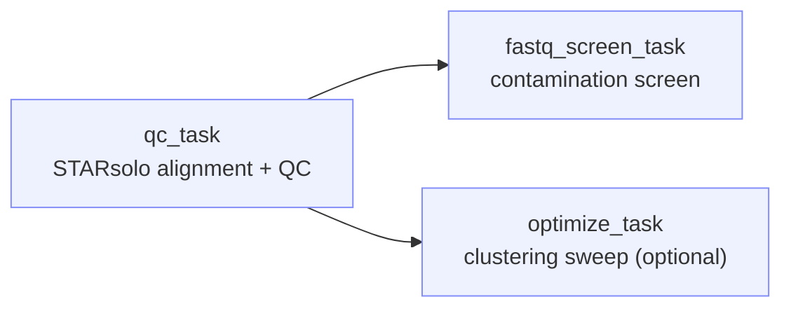

# RNAQC

!!! info "At a glance"
    **Repository:** [atlasxomics/rnaqc_wf](https://github.com/atlasxomics/rnaqc_wf) ·
    **Display name:** RNAQC ·
    **Modality:** Whole Transcriptome · **Stage:** Preprocessing



<p style="text-align:center;font-size:0.75rem;opacity:0.7;margin-top:-0.5rem">
Workflow task DAG — <code>qc_task</code> aligns and QCs the reads; FastQ-Screen and
the optional optimization sweep both run on its output.
</p>

## Overview

**RNAQC** is the primary quality-control Workflow for spatial **RNA-seq**
(whole-transcriptome) DBiT-seq data. It processes barcodes, aligns reads with
[STARsolo](https://github.com/alexdobin/STAR/blob/master/docs/STARsolo.md),
produces a per-run gene-expression matrix, and generates a comprehensive
[MultiQC](https://multiqc.info/) report — plus a FastQ-Screen contamination
check and an optional clustering-parameter sweep. Its `<sample>_star/` output
feeds the [optimize_wt](optimize-wt.md) secondary analysis.

Like [epigenomic preprocessing](../epigenomics/preprocessing.md), RNAQC supports
optional [cleaning](../reference/glossary.md#cleaning) and
[cross-talk correction](../reference/glossary.md#cross-talk-correction) via a
`ds_table` correction table.

## Steps

1. **`qc_task`** — The core QC step. Processes barcodes from read 2
   (`fastq-processor-mp-plusFuz_v3.py`), optionally applies cleaning /
   cross-talk correction, aligns with **STARsolo** (`rnaqc.py` +
   `rnaQC_v7_wf.yaml`), and collates metrics (`collate_metrics.py`) into the
   `<sample>_star/` output directory and a MultiQC report.
2. **`fastq_screen_task`** — Screens read 1 against contamination reference
   databases with [FastQ-Screen](https://www.bioinformatics.babraham.ac.uk/projects/fastq_screen/).
   Runs after `qc_task`; output uploaded to `fastq_screen/`.
3. **`optimize_task`** — *(only when `run_optimize` is enabled)* A Scanpy
   clustering-parameter sweep over the QC'd data — sweeps `resolution`,
   `n_comps`, `n_neighbors`, `min_dist`, and `spread`, and emits UMAP / spatial /
   QC galleries and per-run medians (a lightweight preview of
   [optimize_wt](optimize-wt.md)).

## Inputs

| Parameter | Type | Default | Description |
|---|---|---|---|
| `sampleName` | str | — | Sample name (used to name outputs). |
| `remoteReadOne` | LatchFile | — | Read 1 FASTQ. |
| `remoteReadTwo` | LatchFile | — | Read 2 FASTQ (barcodes). |
| `referenceGenome` | str | — | Reference genome for STAR. |
| `spatial_dir` | LatchDir | — | [Spatial folder](../reference/glossary.md#spatial-folder). |
| `bcSet` | str | `bc220` | Barcode set. |
| `starSet` | str | `atlasRNASeq` | STAR ParamSet. |
| `outReads` | int | `10000000` | Reads to process (downsample target). |
| `run_optimize` | bool | `False` | Run the optional clustering sweep (step 3). |
| `output_directory` | LatchDir | `latch:///rnaSeqQC_output` | Output location. |

??? note "Cleaning / cross-talk correction"
    | Parameter | Default | Description |
    |---|---|---|
    | `cleaning` | `False` | Apply [cleaning](../reference/glossary.md#cleaning) (needs a `ds_table` with `mer`, `finalDownFract`). |
    | `xtalk_correction` | `False` | Apply [cross-talk correction](../reference/glossary.md#cross-talk-correction) (needs a `ds_table` with `mer`, `row`, `col`, `xtalk_mask`, `fold_above_background`). |
    | `xtalk_threshold` | `2.0` | Minimum `fold_above_background` for correction. |
    | `ds_table` | — | The cleaning / cross-talk correction table. |
    | `seed` | `100` | Random seed (downsampling). |

??? note "Optimization-sweep parameters (used when `run_optimize`)"
    | Parameter | Default | Description |
    |---|---|---|
    | `resolution` | `[1.0]` | *Swept.* Clustering resolution. |
    | `n_comps` | `[30]` | *Swept.* Number of components. |
    | `n_neighbors` | `[15]` | *Swept.* Neighborhood size. |
    | `min_dist` | `[0.5]` | *Swept.* UMAP minimum distance. |
    | `spread` | `[1.0]` | *Swept.* UMAP spread. |
    | `min_genes` | `1` | Minimum genes per cell. |
    | `min_cells` | `1` | Minimum cells per gene. |
    | `pt_size`, `qc_pt_size` | — | Override cluster / QC spatial-plot point sizes. |

## Outputs

Written to `output_directory` (default `latch:///rnaSeqQC_output/`). Everything
for the sample lands under the **`<sample>_star/`** directory — the FastQ-Screen
results and the optional optimization sweep are nested inside it:

```text
rnaSeqQC_output/
└── <sample>_star/                    # alignment & QC (STARsolo)
    ├── … count matrix, MultiQC report, QC metrics & plots
    ├── … FastQ-Screen contamination results
    └── optimize_outs/                # optional clustering sweep (run_optimize)
        ├── figures/                  # UMAP / spatial / QC galleries
        └── <set>/combined.h5ad       # per parameter set
```

### `<sample>_star/` — alignment & QC

| File | Description |
|---|---|
| gene-expression matrix (`EM.mtx` + barcodes / features) | STARsolo count matrix — the input consumed by [optimize_wt](optimize-wt.md) (`gex_dir`). |
| `<sample>_anndata.h5ad` | AnnData assembled from the count matrix. |
| `<sample>_collated_metrics.csv` | Collated per-run QC metrics. |
| `<sample>_per_cell_dup_rate.csv` | Per-cell (per-barcode) duplication rate. |
| `<sample>_multiqc.html` | MultiQC report bundling the QC plots below. |
| `Summary.csv`, `STARmanual.pdf` | STARsolo run summary and manual. |
| `*_mqc.png` / `*_mqc.csv` | QC plots and tables — gene-count histograms, coverage, exon-length, mito / ribo gene hits, RNA-species, slice plots, etc. |

### FastQ-Screen results

Uploaded into `<sample>_star/`.

| File | Description |
|---|---|
| `<sample>_screen.txt` (+ plots) | FastQ-Screen results — fraction of read 1 mapping to each contamination reference. |

### `<sample>_star/optimize_outs/` — optimization sweep *(when `run_optimize`)*

| File | Description |
|---|---|
| `all_umaps.pdf`, `all_spatialdim.pdf`, `spatial_qc.pdf` | UMAP, spatial cluster, and spatial QC galleries across the swept parameter sets. |
| `medians.csv`, `metadata.csv` | Per-run QC medians and the parameters used. |
| `<set>/combined.h5ad` | Clustered AnnData per parameter set. |

## Example run

*(Representative LaunchPlan / batch-table example to be added.)*
